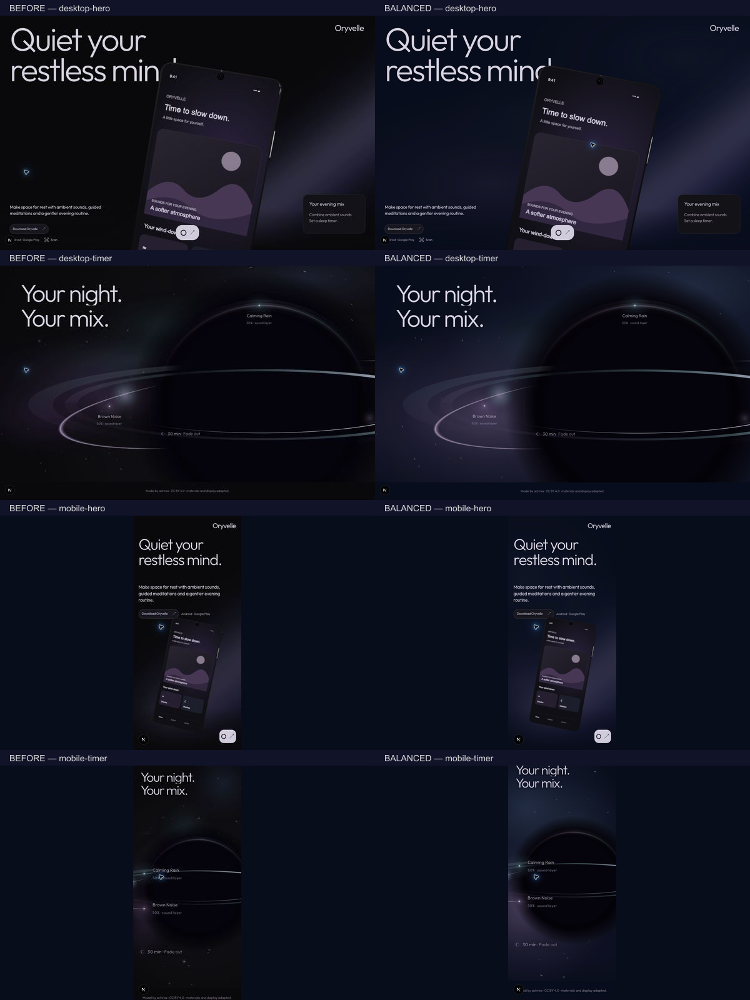
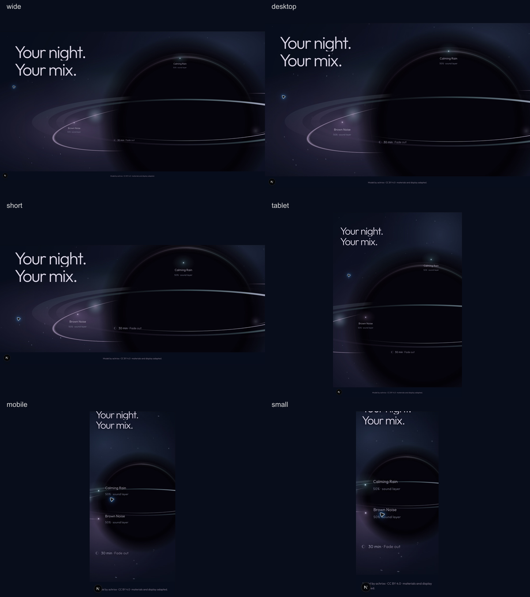

# Gate 04R.6B — Balanced Night Atmosphere Prototype

Status: implemented for visual review. No Section 03 or Section 02 hardening. Review: http://localhost:3000/new

## Scope and preserved baseline

Implemented treatment B from Gate 04R.6A: one night language with chapter-owned exposure, localized blue/lavender/teal depth, and a genuinely dark void. This changes backgrounds, not product lighting.

Before editing, recorded SHA-256 hashes for 49 existing route/runtime/asset files in [source-before.json](captures/gate-04r6b/source-before.json), and copied the previous gate's same-size captures into `captures/gate-04r6b/before/`. The final comparison identifies seven changed existing files and 42 unchanged files. In particular, every phone model/material/light/float/screen file, the opening pose/timeline files, boundary-state functions, and the orb geometry renderer are unchanged. The original GLB, master Blender file, poster and screens were not edited. The loader and supporting UI were not edited.

Ambient float makes phone angles differ slightly between independently captured stills. Those differences are elapsed-time sampling, not authored pose/framing changes. Before captures come from the preceding gate, not a separately deployed baseline application.

## Before / after

The opening gains a colored distance field behind the existing diagonal beam. The stand becomes more legible against broad haze, without adding a contact spotlight. The world gains separated illuminated sectors that disappear behind the opaque core. The center, ring geometry, crop, typography and factual labels remain the same.

## Shared recipe and exact source tokens

`components/landing/atmosphere/night-atmosphere.ts` owns only palette, static field recipe and pure exposure functions. It owns no lifecycle, transforms or progress source.

| Token | Value | Purpose |
|---|---|---|
| base | `#080d1b` | Deep navy-black foundation |
| indigo | `#111329` | Quiet depth trough / secondary wash |
| blue | `#27354e` | Muted upper/right distant light |
| lavender | `#514464` | Lower/left distance haze |
| teal | `#29444c` | Local cool separation |
| void | `#05030b` | Existing void identity; geometry renderer unchanged |

These are transparent gradient sources, not solid colored viewport panels. Each wash falls from its source alpha at the center to 35% of that alpha at 46% of its elliptical radius, then to transparent. Four desktop radial washes occupy one background element, not four fullscreen filtered DOM layers.

| Desktop wash | Center x/y | Elliptical radius x/y | Source alpha |
|---|---|---|---|
| lavender | 31% / 72% | 51% / 40% | .88 |
| blue | 83% / 18% | 46% / 37% | .82 |
| teal | 46% / 43% | 27% / 23% | .65 |
| indigo | 72% / 60% | 40% / 39% | .65 |

The field element's overall opacity then controls chapter exposure. No gradient stops or positions animate continuously.

### Intensity curve

- Opening: .22 through the dominant phone chapter; smooth progression from .22 to .38 over existing local progress .73–1. No stars added to the hero.
- Stand/departure: boundary contributes progressively toward a combined .78. The approved beam/desk illumination still follows its existing fade; the new night survives independently beneath it.
- Recognition: .78 on both sides of the handoff.
- World: smooth .78 → 1 over existing world progress 0–.20.
- Timer: subtract .15 times the existing settlement factor; final exposure .85. Depth remains present while energy decreases.

All curves reconstruct directly from progress with smoothstep. No new scroll distance or animation keyframe was introduced.

## Ownership and handoff

### Why the Canvas background changed

The previous world drawing painted an opaque neutral-black base and a cached nebula image behind the orb/stars. Adding CSS below that would either be invisible or require two atmosphere providers. The static far field is now a shared CSS recipe beneath the existing transparent Canvas. Canvas retains orb drawing, core occlusion, rings, sparse stars and their existing ambient behavior. The detached nebula-cache generation was removed; no visible Canvas was added.

### Opening → boundary

One `NightAtmosphere` element stays inside the existing persistent opening stage. The opening's existing progress callback writes `--night-opening`. Boundary painting writes `--night-boundary`; it does not overwrite opening exposure. CSS sums these contributions. The original diagonal atmosphere stays in its original layer above the new far field, and its existing boundary fade is unchanged.

For the normal settled state, the sum is .38 + .40 = .78. In the static opening fallback, the opening remains at .22; boundary contribution resolves from that actual value, so .22 + .56 also reaches .78. There is no new progress owner or ScrollTrigger. The boundary removes its contribution during cleanup.

### Boundary → world

The downstream world uses the same recipe, viewport dimensions and base color. Its initial exposure is .78. Its opaque stage base covers the preceding stage when the world takes over, so two full-strength fields do not add together during overlap. The core is painted above the field; stars are drawn behind that opaque core using the existing Canvas compositing path.

Measured at 1440×900, document scroll 6660 → 6663:

- boundary and world computed `background-image` strings were identical;
- both exposure values were .78 at the exact handoff;
- a quiet top-left 200×200 sky region had mean and maximum RGB channel difference **0** between adjacent handoff captures.

This is a localized endpoint check, not a claim of pixel equality across the moving ring or all viewport sizes. Slow forward/reverse review did not reveal a background brightness/color reset.

[Immediately before handoff](captures/gate-04r6b/cropped/handoff-before.png) · [Immediately after](captures/gate-04r6b/cropped/handoff-after.png) · [Pixel check](captures/gate-04r6b/handoff-pixel-check.json)

### DOM/Canvas layering

World visual wrapper is z-index 0, its Canvas is above its own static field, and story content is z-index 1. During review, a first stacking adjustment briefly put some labels behind the Canvas; it was corrected before final captures. No labels or positions were redesigned.

## Desktop and mobile

At the existing 760px boundary, mobile gets three deliberately authored washes rather than scaled desktop geometry:

| Mobile wash | Center x/y | Elliptical radius x/y | Source alpha |
|---|---|---|---|
| blue | 17% / 26% | 85% / 36% | .88 |
| lavender | 12% / 71% | 83% / 32% | .84 |
| teal | 60% / 37% | 47% / 24% | .48 |

This makes the upper/left sky wedge readable, while lower lavender provides contrast around the recognizable core. No extra height, spacer or mobile travel was added. The approved 90svh boundary and mobile early star/formation timing remain unchanged. Tablet keeps the desktop field and its existing portrait viewport composition.

At the absolute bottom of the 320px page, the preceding title can crop as attribution enters; the existing sticky-stage release/layout is unchanged. That is not a new atmosphere spacer or a retimed chapter.

## Motion restrictions

No new cosmic-life motion was added. Recent richer life controls are explicitly inactive for this still-atmosphere review (`life: 0`): no shooting stars, infall streaks, stronger scintillation, added lensing travel or richer ring-energy variation. Their pure helper implementation/tests remain available for a later authorized motion gate.

The established gentle ambient draw loop and sound-star child drift remain; no new scheduler or RAF exists. Night exposure is written only when its value changes, not on every ambient draw. No CSS gradient animation, blur stack, particle system, new renderer, global store or dependency was introduced.

## Fallback and reduced motion

- Existing prepared-phone poster readiness/lifecycle retained.
- Forced opening poster plus orb fallback was reviewed at 1440×900. Both retain the same night palette and localized field; fallback core/ring sits above it. Old duplicate fallback nebula fills were replaced with transparent backgrounds.
- Reduced-motion emulation was tested with DevTools retained: complete world content, elapsed time 0.0, render state `static`, and three initialization draws. The palette/field is static and remains dimensional.
- Reduced-motion boundary has an opaque base and the same static recipe, avoiding additive full-strength haze.
- Context-loss listener and error fallback remain unchanged. The development context-loss button was attempted, but this browser reported `WEBGL_lose_context extension not supported`; an actual lost-context event could not be forced. Forced static fallback was validated instead. Do not interpret that as a successful real context-loss test.

[Fallback hero](captures/gate-04r6b/cropped/fallback-hero.png) · [Fallback world](captures/gate-04r6b/cropped/fallback-world.png) · [Reduced-motion world, DevTools visible](captures/gate-04r6b/after/reduced-world.png)

## Rendering / paint observations

The new atmosphere has no autonomous work. It consists of bounded predeclared gradients with scroll-dependent opacity; no fullscreen filter, continuously modified gradient or extra `will-change` is used. The original phone demand-rendering and world visibility/media guards remain unchanged.

Actual development-browser samples at 1440×900, world progress .5013:

- eight recorded world draw costs: .40, .20, .30, .20, .30, .20, .30, .30 ms;
- average .275 ms, observed range .20–.40 ms;
- offscreen after returning Home: frame count 741 and elapsed 32927.0 stayed unchanged across four samples; render state `static`;
- Canvas backing sizes stayed 1440×900 in this DPR-1 emulation; existing DPR cap remains 1.5;
- fallback does not activate the ambient ticker; reduced motion remained static.

[Raw render samples](captures/gate-04r6b/render-samples.json)

These are CPU drawing diagnostics, not full GPU/raster/compositing costs or a production FPS/Core Web Vitals benchmark. No before/after CPU baseline was measured, so no performance improvement claim is made. CSS opacity is eligible for compositing, but layer promotion was not profiled. Hidden-tab source guard is preserved; the browser inspection surface kept/reactivated the inspected tab, so a trustworthy hidden-tab counter measurement was not obtained. No battery/memory/mobile-device-performance claim is made.

## Validation and checkpoint captures

Brave review covered normal forward motion, slow scrolling and reverse traversal. Checkpoints were captured at each target size, including hero/front, rear, returning front, stand, departure, ring, recognizable orb, world and timer. Pixel comparisons are approximate compositions because ambient elapsed time differs.

| Viewport | Review | Capture set |
|---|---|---|
| 1920×1080 | Wide desktop forward/reverse | `wide-*` |
| 1440×900 | Normal desktop, handoff endpoints, fallback/reduced motion | `desktop-*` |
| 1440×650 | Short desktop forward/reverse | `short-*` |
| 820×1180 | Tablet forward/reverse | `tablet-*` |
| 390×844 | Mobile full continuity/reverse | `mobile-*` |
| 320×720 | Small mobile full continuity/reverse | `small-*` |

1440×900 checkpoint sequence:

1. [Hero/front](captures/gate-04r6b/cropped/desktop-hero.png)
2. [First back](captures/gate-04r6b/cropped/desktop-back.png)
3. [Returning front](captures/gate-04r6b/cropped/desktop-return.png)
4. [Landscape stand](captures/gate-04r6b/cropped/desktop-stand.png)
5. [Departure](captures/gate-04r6b/cropped/desktop-departure.png)
6. [Early ring](captures/gate-04r6b/cropped/desktop-ring.png)
7. [Recognizable orb](captures/gate-04r6b/cropped/desktop-recognition.png)
8. [World](captures/gate-04r6b/cropped/desktop-world.png)
9. [Timer](captures/gate-04r6b/cropped/desktop-timer.png)

Mobile examples: [390px ring](captures/gate-04r6b/cropped/mobile-ring.png), [390px recognition](captures/gate-04r6b/cropped/mobile-recognition.png), [390px timer](captures/gate-04r6b/cropped/mobile-timer.png), [320px recognition](captures/gate-04r6b/cropped/small-recognition.png).

[Viewport/scroll/field metadata](captures/gate-04r6b/after/review-states.json) · [Frozen-file comparison](captures/gate-04r6b/frozen-file-check.json)

### Automated checks

Final run: ESLint passed; `tsc --noEmit` passed; complete Vitest suite **11 files / 52 tests passed**; Next production build passed with `/new` statically generated; `git diff --check` passed. Added three focused atmosphere tests for endpoint/fallback equality, deterministic reverse reconstruction and settled depth, and deterministic desktop/mobile field definitions. No dependency changes in this gate.

Browser console showed the existing Three.Clock deprecation warning and the unsupported context-loss extension warning from the deliberate test. No new application error was observed during normal review.

## Exact code files changed

New:

- `components/landing/atmosphere/NightAtmosphere.tsx`
- `components/landing/atmosphere/night-atmosphere.ts`
- `components/landing/atmosphere/night-atmosphere.module.css`
- `components/landing/atmosphere/night-atmosphere.test.ts`

Modified:

- `components/landing/chapters/opening/OpeningChapter.tsx` — field placement and exposure in existing progress application.
- `components/landing/chapters/opening/opening.module.css` — shared base color, including attribution/release background.
- `components/landing/chapters/boundary/LightToOrbBoundary.tsx` — contribution/exposure, removal of duplicate detached field, static reduced-motion field.
- `components/landing/chapters/boundary/boundary.module.css` — shared base / transparent fallback field.
- `components/landing/chapters/orb-world/OrbWorld.tsx` — shared field, no nebula cache, postponed richer life controls.
- `components/landing/chapters/orb-world/orb-world.module.css` — base, field/Canvas/content stacking, transparent fallback field.
- `components/landing/chapters/orb-world/cosmic-field.ts` — sparse stars retained; CSS now supplies the static far field instead of Canvas base/nebula fill.

Also added this report and capture/evidence files. No production asset was replaced. Initial unrelated package and repository work remains preserved on `feat/flowty-fidelity-redesign`.

## Review limits / background-only sufficiency

Background-only treatment was sufficient to improve phone and stand silhouette separation without changing their approved materials or lights. It also makes the void readable through occlusion, rather than adding a brighter center or thicker ring. It does not repair any geometry/material detail or turn temporary stand art into final artwork; those were intentionally untouched.

The gradients remain intentionally smooth and quiet. Dark display quantization/banding can vary by screen; no large texture/noise asset was added to conceal it. This is still a visual approval gate. Richer cosmic motion, Section 02 hardening and Section 03 remain deferred.
