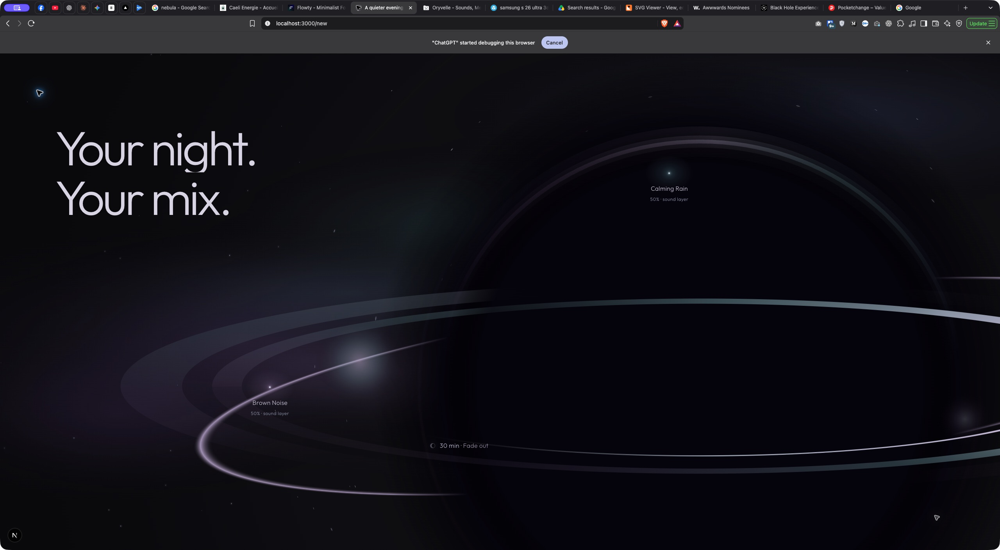

# Gate 04R.6 — Cosmic Life & Black-Hole Lensing Polish

Review: http://localhost:3000/new

**Latest calibration below is untested at the user’s request. The check results and performance samples in the original gate describe the prior, subtler revision, not the current changes.**

Implemented for visual review only. Production hardening and Section 03 have **not** begun.

## Scope / frozen output

Branch: `feat/flowty-fidelity-redesign`; existing dirty/untracked work preserved. Pre-edit SHA-256 inventory: [source baseline](captures/gate-04r6/source-baseline.json).

Only three existing implementation files differ:

- `chapters/orb-world/cosmic-field.ts`: localized star response, differentiated shimmer/depth, rare streak drawing, restrained cached-nebula depth.
- `chapters/orb-world/OrbWorld.tsx`: opts the existing world draw into ambient life; development-only elapsed/event diagnostics.
- `chapters/mix/orb-renderer.ts`: optional world-only material-life strength. Defaults preserve boundary behavior.

New: `cosmic-life.ts` (pure deterministic sampling) and its focused tests. No CSS, JSX content, new visible Canvas, WebGL, shader, dependency, scheduler or asset. No cleanup of the earlier rejected constellation implementation in this gate.

Section 01, entry, phone, stand, supporting UI, boundary component/state/styles and world CSS are byte-identical to the baseline. All timeline keyframes, typography, sound-star parent positions/entrances, level/timer staging, responsive dimensions and pacing remain unchanged. The previously documented extreme-height `svh` remapping remains; no scroll adjustment was introduced.

## Before → after rationale

The prior field used equal shimmer amplitude, one nebula drift and lensing centered at .93 of the orb's base radius. The visible core ends near .46R and its soft shadow extends farther. The old influence therefore acted mainly away from the readable horizon. The field felt less spatially connected to the black hole.

The revised world places a broad, soft influence around that feathered horizon. Individual distant points gently bend and stretch; nearer points vary in brightness and apparent depth. Front/rear ring light evolves independently. Rare passing light adds an occasional far-field event, without turning the scene into a particle system. The dark core is stable throughout.

## Lensing field

World influence is a Gaussian centered at `.59R`, width `.18R`:

```text
influence = exp(-((distance / radius - .59) / .18)^2)
```

- No hard radial cutoff, clipping edge or drawn warp boundary.
- Angular bending approaches `.053 rad` at strongest influence, with at most approximately `.004 rad` of slow local variation before settlement.
- Additional radial displacement is at most `.008R`.
- Tangential footprint approaches 4.6× each star's tiny base size. This is a small elongated point, not a bright orbital stroke.
- Influence is effectively zero far away: at 1.6R it is below .000001.
- Tiny depth-weighted positional drift stays below 1px horizontally / .6px vertically before settlement.
- The field stays behind the existing opaque core/rings using `destination-over`; it never textures the black center.

This is an artistic deflection field, not a physical ray-tracing or pixel-displacement simulation. Its visible purpose is to connect nearby space to the orb while keeping the far field quiet.

## Star life / density

The original seeded coordinates, sizes, base brightness and count remain: **84 desktop/tablet, 38 mobile**. No new permanent points.

Per-star phase determines:

- apparent depth .30–1;
- primary shimmer period 11–37 seconds;
- a secondary period 1.63× longer with a different phase;
- shimmer amplitude .06–.24 before settlement;
- a restrained depth-dependent brightness/footprint difference.

Two oscillations combine with weights .72/.28. Stars do not share a pulse. Calming Rain and Brown Noise keep their existing larger sound-light cores, names and attached 50% labels. Their approved additive drift is unchanged and already decreases during settlement.

## Rare shooting stars

No emitter or object simulation. `shootingStarEvent(index)` is a seeded integer-hash schedule, sampled from the existing **visible active elapsed clock**:

- event starts at `18 + index × 29 + seeded jitter (0–10 seconds)`;
- first event starts at ~26 active seconds;
- duration 1.1–1.7 seconds;
- guaranteed quiet gap exceeds 17 seconds after the previous event ends;
- each event varies its starting location, shallow direction and duration;
- path crosses 10–18% of viewport width and 4–8% of height;
- soft tail capped at 34px, .8px stroke, low peak exposure;
- drawn behind orb and DOM content, not over typography or the meaningful sound-stars;
- fully disabled for reduced motion;
- intensity decreases toward settlement; no streak remains eligible at settlement ≥.55, corresponding to chapter progress ~.8935.

No wall-clock date, `Math.random()`, React state per frame or hydration-dependent scheduling. A naturally scheduled event was observed/captured at active elapsed **55.043s**, world progress .6538: [event state](captures/gate-04r6/shooting-star-state.json). It was not forced via a debug clock or timeline seek.

## Nebula depth

The existing six lavender/teal/blue washes are unchanged. The same detached raster cache is reused; no second visible or detached Canvas is created for this gate.

Two weighted exposures (.68/.32 once life is established) give the same cached atmosphere tiny different offsets:

- existing x/y drift remains the primary layer;
- an additional ±2px / ±1.5px irregular offset uses slower 89s/113s angular time scales;
- the quieter exposure moves only a few pixels with 137s/173s angular time scales;
- all movement attenuates with settlement.

These are long-period shallow movements, not a large looping wallpaper translation. Total exposure is bounded at the old field opacity; overlapping weighted passes slightly redistribute that exposure rather than increasing nebula density. Existing cache dimensions/DPR policy remain unchanged.

## Orb material life

`drawOrbFormation()` accepts optional `life`, defaulting to zero. Only the downstream world opts in. World life rises smoothly through the existing first .09 progress interval; it does not add scroll travel or move any recognition threshold.

- Existing slow disk/flow phases gain small compound variations with distinct time scales: 19/31s and 23/37s angular scales.
- Front/rear illumination differ: rear uses 21/39s; front 27/43s.
- Horizon illumination uses 33/51s.
- Each compound wave starts at zero, avoiding a material pop at recognition.
- No radius change, core brightness pulse, object rotation or geometry movement.
- Local lavender/teal variation comes from slow phase travel through the existing material gradients.
- Settlement reduces variable energy to 32% of its unsupported value; the existing ambient clock also slows to 45%, making the endpoint calmer.

The black core's position, scale, void color and drawing passes remain stable. Boundary calls retain `life=0`; the earlier drawing-contract test continues to pass.

## Timer settlement / ownership

`30 min · Fade out` keeps its existing placement and timeline. Existing settlement remains progress .80–.97.

- Star shimmer amplitude decreases by up to 68%.
- Tiny far-field drift and nebula offsets soften.
- New material-life variation decreases by 68%.
- Existing sound-star drift remains at its approved 28% strength at settlement.
- Shooting-star intensity falls to zero before the final resting state.
- The world remains quietly alive; it does not abruptly freeze.

The existing ScrollTrigger owns chapter progression and DOM parent transforms. The existing GSAP ticker owns only ambient time/child offsets. Canvas owns drawing. React owns lifecycle/fallback. No competing property owners.

## Lifecycle / accessibility

Preserved existing eligibility and cleanup:

- ticker runs only when supported, visible, document not hidden, motion allowed and chapter progress positive;
- no extra RAF or GSAP ticker listener;
- active elapsed freezes when offscreen/hidden; there is no catch-up burst;
- observers, media listeners and ticker are symmetrically removed;
- reduced motion has complete static content, no autonomous drawing and no shooting stars;
- explicit opening-poster + orb fallback remains static and readable.

Reduced-motion Brave emulation confirmed counter **853 → 853**, elapsed unchanged, render state static and shooting-star flag false. Offscreen return to supported phone confirmed counter **2665 → 2665**, elapsed unchanged and static state across later inspection.

A hidden-tab probe was attempted, but this browser automation session continued reporting `document.hidden=false`; hidden-tab suspension is preserved by code ownership but **not claimed as newly browser-proven**.

Context7 consulted: [GSAP ticker listener ownership, delta milliseconds and removal](https://gsap.com/docs/v3/GSAP/gsap.ticker/). Global ticker FPS was not changed; the existing local draw throttle remains.

## Measured performance

Read actual existing `orbDrawMs` diagnostics while the chapter was visible. These are small samples of CPU Canvas submission duration, rounded to .1ms, **not GPU raster time, total frame time or FPS**.

| State / viewport | Samples | Range | Median |
| --- | ---: | ---: | ---: |
| Prior field, 1440×900, progress .6538 | 16 | .2–.5ms | .3ms |
| Revised field, same viewport/progress | 12 | .3–.4ms | .4ms |
| Revised settled endpoint, 1440×900 | 8 | .2–.4ms | .3ms |
| Revised mobile, 390×844, progress .8329 | 12 | .3–.4ms | .3ms |

The prior-field samples were collected from the still-loaded baseline before reloading the new implementation. Revised samples were collected after explicit reload and presence of the new elapsed/event diagnostics. JSON sample files are retained under `captures/gate-04r6/`.

Additional isolated live observations reached .7–.8ms during the shooting-star window. No sustained regression, FPS/battery gain, memory benchmark or Core Web Vitals claim is made. Added work is bounded star sampling, at most one brief streak and one additional cached-image draw. No new fetched image, model or font. Existing nominal 30-paint/s local cap remains; settlement lowers effective activity through the existing slower clock.

## Visual validation

Live Brave inspection included:

- refresh → approved entry/opening → stand → unchanged boundary → object-only hold;
- paused world observation across tens of seconds;
- naturally scheduled far-field streak;
- normal forward progression through sound entrances/levels/timer;
- reverse through hold, formation and supported phone;
- 1440×900 desktop, 1440×650 short desktop, 1024×900 tablet;
- 390×844 and 320×720 mobile; 320px document width remained 320px;
- default 2560×1273 viewport, normal `/new` route;
- reduced motion and explicit poster/orb fallback;
- offscreen suspension; hidden-tab caveat above.

No new cosmic runtime error observed. Existing Three.Clock deprecation warning remains. Build was completed before final visual validation; the development server's reload while rebuilding was not treated as page lifecycle behavior.

## Captures

Native Brave captures were used for live scroll state; document screenshots are crops of the same native capture, not modified production compositions.

| State | Capture |
| --- | --- |
| Baseline at .6538 | [Before](captures/gate-04r6/before-world-crop.png) |
| Revised at .6538 | [After](captures/gate-04r6/after-world.png) |
| Object-only hold | [Hold](captures/gate-04r6/object-hold.png) |
| Naturally scheduled shooting star | [Streak](captures/gate-04r6/shooting-star.png) |
| Settled timer | [Timer](captures/gate-04r6/timer.png) |
| Mobile 390×844 | [Mobile](captures/gate-04r6/mobile-world.png) |
| Mobile 320×720 | [Narrow](captures/gate-04r6/mobile-320.png) |
| Tablet | [Tablet](captures/gate-04r6/tablet-world.png) |
| Short desktop | [Short](captures/gate-04r6/short-desktop.png) |
| Reduced motion | [Reduced](captures/gate-04r6/reduced-native.png) |
| Static fallback | [Fallback](captures/gate-04r6/fallback-native.png) |
| Normal-route review | [Review](captures/gate-04r6/review-world.png) |



## Checks / stop gate

- ESLint: pass.
- TypeScript: pass.
- Full tests: **10 files / 49 tests pass**.
- Production build: pass; `/new` generated.
- `git diff --check`: pass; additional source whitespace check covers untracked files.
- Focused new tests protect seeded density, independent shimmer, smooth near/far influence, long deterministic streak gaps, reduced-motion/settlement suppression and nonzero calmer endpoint life.

Stopped for visual review. Production hardening remains the next gate **after this art direction is approved**. No Section 03.


## User-directed visibility calibration — pending user testing

The user found the first pass effectively static and supplied a six-second motion reference. This calibration changes only ambient behavior. No browser validation, lint, TypeScript, test execution, build, performance measurement or diff check was performed for it, as explicitly requested.

### Video inspection

Inspected six sequential extracted frames from the supplied 752×416 / 24fps video. [Motion-study contact sheet](captures/gate-04r6-calibration/video-motion-study.jpg). The useful cues are localized star glints, richer ring light and readable atmospheric depth. Its dense sound map, extra controls, labels, saturation and camera zoom are not adopted. The video is not copied into public/runtime assets.

### More perceptible ambient behavior

- Independent star shimmer changes from 11–37s to 3.5–8.5s base periods, with a slower secondary wave and separate phases. Base amplitude becomes .30–.62 before settlement. A few deeper/brighter points acquire short-lived optical glints and expanding soft halos; permanent star count remains 84/38.
- Alpha is capped explicitly so brighter shimmer cannot pass an invalid value to Canvas globalAlpha.
- Near-horizon bending gains stronger, faster local angular/radial variation. Far stars remain outside the smoothly falling influence.
- Three short moving light fragments converge toward the horizon along shallow curved trajectories. Their radius decreases from .94R toward .45R, with increasing angular bend; the stable existing core occludes their inner ends. Only a moving fragment is drawn, never an entire spiral or traced technical path. Each has its own 9.5–15.7s travel cycle and fades at cycle boundaries. This is bounded Canvas illumination, not a particle emitter.
- Accretion phase/illumination variation becomes stronger and faster, using different compound waves. The black center never changes scale, position or void color. Only material light evolves.
- Cached nebula drift becomes more readable, with shallow differing rates; wash count/colors stay unchanged. Image offsets remain within the existing padded drawing bounds.
- The two meaningful sound-stars have more perceptible independent light-intensity breathing. Their names, parent trajectories, positions, levels and child drift paths remain unchanged.
- Shooting-star first appearance changes from ~26 active seconds to ~5.7 active seconds. Events are spaced by 16s plus independent 0–4s jitter, last 1.6–2.5s and retain over nine seconds of quiet between events. Tails grow up to 72px desktop / proportional mobile size, with a brighter soft head. Their shallow far-field travel is more readable.
- Settlement still softens motion. New energy remains at 50% rather than 32% at the endpoint, alongside the existing slower ambient clock. New shooting stars remain suppressed near the final resting state; watch the established world before the timer settles to review them.

### Preserved boundaries

Section 01, the stand/light-to-orb transition, object/crop geometry, scroll keyframes, typography, content, sound positioning/story, levels, timer and responsive pacing are unchanged. Boundary calls do not opt into world life, so the stronger effects remain downstream. No automatic scroll adjustment for the existing extreme-height semantic remapping.

Uses the same Canvas, cached nebula and existing GSAP ticker. No additional scheduler, WebGL, dependency or runtime video/image. Reduced motion suppresses autonomous movement and inward streaks; existing offscreen, hidden and fallback eligibility remains. These behaviors are preserved in code, not newly verified in this calibration.

Existing focused test expectations were updated for the new bounded shimmer/cadence contract, but **were not executed**. The earlier 49-test/build success must not be read as validation of this revision.

### Assets / review

No new production assets are required for this pass. Curved light, glints and streaks are native Canvas drawing. A custom atmospheric texture could be considered later if the user wants closer photographic richness; it is not required or requested now.

Refresh http://localhost:3000/new to review. Continuous motion, intensity balance, mobile behavior, drawing cost and regressions remain pending the user's testing. Production hardening and Section 03 have not started.
