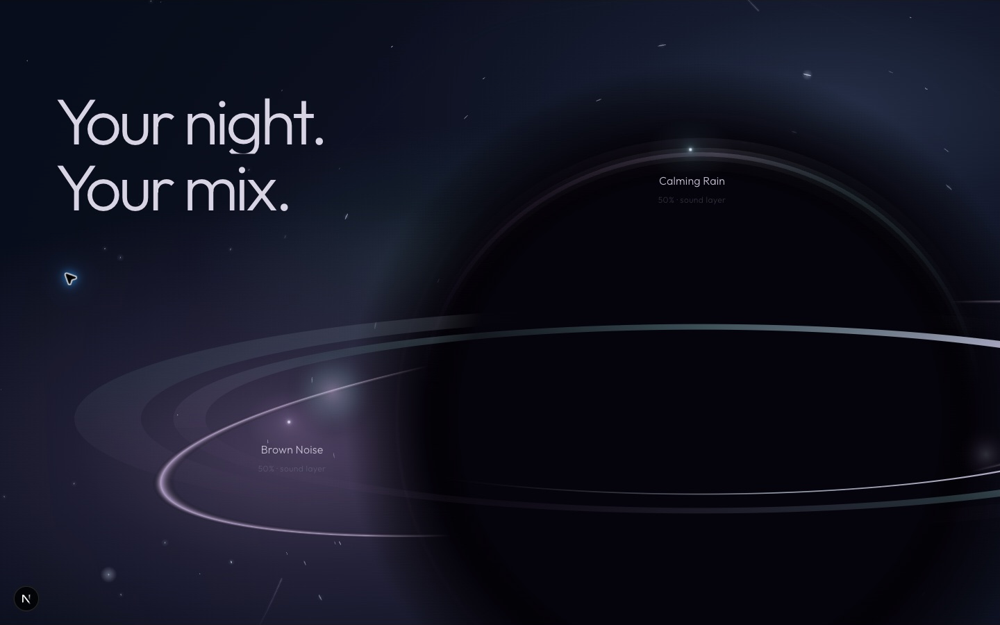
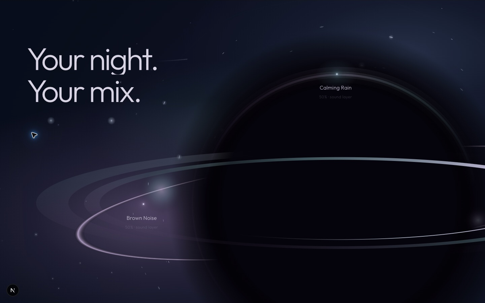
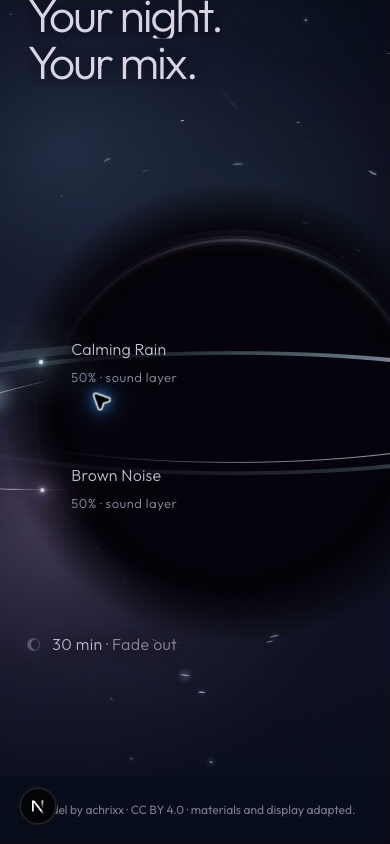

# Cosmic life restoration / stable sound labels

Review: http://localhost:3000/new

## Correction

The still-atmosphere Gate 04R.6B intentionally passed `life: 0`. That disabled the stronger existing star scintillation, moving horizon response, inward curved light and deterministic shooting stars. The ambient ticker still ran, but the visible result was largely static.

Sound drift also targeted the wrapper containing each light **and** its caption. That produced up to 6px vertical drift in Rain text and 5px in Noise text, including subpixel text rasterization changes.

Changed only `components/landing/chapters/orb-world/OrbWorld.tsx` and its CSS module:

- Restore existing cosmic-life sampling. Strength eases from zero to full over the existing first .09 world progress, after the unchanged boundary. No new timeline or recognition timing.
- Re-enable smooth near-horizon star bending, tangential elongation and the existing three localized inward curved light traces. Far stars remain essentially undistorted. The black center stays fixed.
- Restore irregular accretion/highlight/horizon material variation without moving/scaling the entire orb.
- Existing independent star shimmer uses varied 3.5–8.5 second base periods and secondary harmonics; no extra stars.
- Restore pseudorandom shooting-star events: deterministic scheduling, 1.6–2.5 second duration, 12–20 seconds between event starts, over nine seconds of quiet between events. They remain behind the opaque core/content and stop near final settlement.
- Move `data-drift` from the shared light/text wrapper onto the light element. Authored scroll entrances still target the same outer figures; ambient motion targets only their light child. Captions/percentages no longer bob.
- Add independent light shimmer and small halo variation to the two meaningful sound-stars. No label opacity/position is driven by ambient sampling.
- Reduced-motion preference changes reset the light transforms/shimmer properties. Existing offscreen, hidden-document, fallback and cleanup guards remain.

No new Canvas, RAF, library, scroll owner, layout, text, asset, atmosphere density or Section 03. Section 01, boundary code, shared Balanced field and authored world timeline values are unchanged.

## Browser evidence

Brave, 1440×900: two stopped-scroll samples separated by roughly 27 seconds at world progress .7308:

- Rain caption bounds remained x921.59375, y248, width150, height49.
- Noise caption bounds remained x345.59375, y635, width150, height49.
- Both computed caption transforms were `none`; light transforms and brightness changed independently.
- Live scheduled shooting star was captured with `data-shooting-star=true`, elapsed 51514ms.
- Observed desktop draw costs in these samples .70–1.30ms, versus the preceding static gate's .20–.40ms samples. This is sparse CPU drawing telemetry, not a full FPS/GPU benchmark.

390×844: inspected active field, forward/reverse, and timer settlement. Endpoint captions remained stationary across two samples while light offsets changed. Reduced-motion emulation: elapsed 0.0, three initialization draws, render state `static`, no light transform, shooting-star false. Forced poster/orb fallback: elapsed 0.0, render state `static`, no light transform. Offscreen returned to static; no hidden-tab behavioral measurement claimed.

[Raw stopped-scroll samples](captures/cosmic-life-restoration/validation.json) · [Reduced motion](captures/cosmic-life-restoration/reduced.json)

## Checks / limitations

ESLint, TypeScript, complete suite (11 files / 52 tests), production build and diff check passed. Existing deterministic motion tests protect star diversity, smooth falloff, event spacing and reduced-motion/settlement suppression. No implementation-mirroring test added for the DOM relocation; bounding-box inspection validates it directly.

Consulted Context7 official GSAP ticker documentation: existing identical callback add/remove and millisecond delta ownership retained. No secondary scheduler or hidden-tab keepalive introduced.

Motion visibility remains an art-direction review. A still cannot convey shimmer or inward motion; stop within the active world to judge it. Timer settlement deliberately reduces motion and suppresses new streaks. No automatic extreme-height scroll remapping added.
