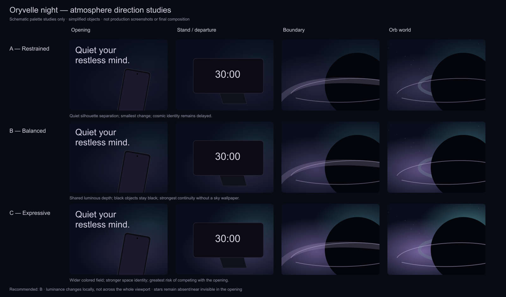

# Gate 04R.6A — Global Oryvelle Night Atmosphere

Status: **art-direction proposal; production unchanged; awaiting review.**

Review route: http://localhost:3000/new

## Decision

Recommend **B — Balanced**, implemented as a **hybrid of shared night tokens, chapter-owned CSS atmosphere, and the existing local Canvas cosmic field**. No global Canvas, new scroll controller, renderer, animation library or raster sky is justified.

The missing ingredient is a continuous far field, not brighter products. Keep the phone and orb dark, but place selective luminous space behind their silhouettes. The richest atmosphere belongs to the orb world; its colors should have been quietly perceptible from the hero onward.

This report is a planning artifact. It does not authorize implementation, change Section 01 lighting/materials, retime the boundary, add content, harden Section 02 or begin Section 03.

## Evidence and limits

Personally reviewed the current live `/new` in Brave, scrolling forward through the hardware turn, returning front, landscape approach, departure, ring recognition and world; also scrolled backward through the world/boundary. Reviewed at **2560×1273, 1440×900, 820×1180 and 390×844**. The wide browser viewport changed from 1329px to 1273px high when its native chrome settled; captures use the latter. Temporary viewport overrides were reset afterward.

Review was continuous native scroll with several pauses, not forced-pose screenshots. Captures are supporting checkpoints; they cannot prove transition quality by themselves. This was an art-direction audit, not a performance benchmark or full regression suite. No lint, tests or build were run; no production code was edited.

The current cosmic calibration follows the previous user-requested untested revision. Its earlier report's historical test/cost samples must not be represented as measurements of the current revision. This gate establishes visual observations only.

Sources:

- Current opening/boundary/world CSS, timelines and Canvas drawing code.
- Existing product research and supplied video motion study: [video contact sheet](captures/gate-04r6-calibration/video-motion-study.jpg). The video is inspiration for depth/light behind a dark object, not a target for density or interface design.
- Current browser captures below.
- Context7 GSAP documentation lookup, cross-checked with [current matchMedia guidance](https://gsap.com/docs/v3/GSAP/gsap.matchMedia()/). Preserve context-owned responsive animation and cleanup; do not revive deprecated ScrollTrigger.matchMedia examples returned alongside current guidance.
- [MDN gradient guidance](https://developer.mozilla.org/en-US/docs/Web/CSS/Guides/Images/Using_gradients): transparent layered radial/linear gradients are sufficient for broad scalable washes without sky raster assets.

## Diagnosis: depth collapses locally, not everywhere

The current hero already has a substantial lavender diagonal beam. Increasing that beam or the entire scene's exposure would miss the problem. Its directional emphasis leaves other regions as nearly uniform neutral black; the object crosses those regions while turning.

The page and world stage use `#09090b`; the orb center uses `#05030b`. Their hue and luminance are close enough that the core often reads from drawn ring geometry rather than from obscuring an illuminated environment. The rear phone itself is readable under its approved lighting, but the surrounding negative space has little depth. The stand base fades into the same floor value.

Implementation evidence explains the atmospheric discontinuity:

- Opening has a blurred diagonal `.beam` and a faint `.deskGlow`, with a neutral-black bottom fade.
- Boundary owns the opening atmosphere's opacity, fading it to zero over its existing .68 interval. Preserve that approved ownership and timing.
- Desktop/tablet boundary draws formation but no cosmic far field. The world reveals that field over its first .20 progress.
- Mobile already reveals the cosmic field inside the boundary (.04–.70); it is not currently a missing-canvas/spacer problem. Its apparent depth is limited by luminance placement and the large dark center.
- The world draws stars/haze behind the opaque core through `destination-over`, then its base field. This is a useful existing occlusion contract. A CSS layer placed underneath an opaque Canvas fill would be invisible; future changes must account for this, not simply stack more gradients behind it.

**Inference:** a broad shared far-field color vocabulary, revealed across the existing overlapping stages, can remove the psychological atmosphere reset. This must be proved in a later prototype; background-only separation has not yet been validated as sufficient at every phone angle.

## Tonal / depth audit

| Moment | Direct visual observation | Proposed atmospheric response |
|---|---|---|
| Hero/front | Pale headline and screen lead strongly. Purple light behind/right is visible; upper and left areas remain largely neutral. Parts of the phone edge merge with the field. | Very dim navy foundation plus broad lavender-blue haze behind the complete silhouette, with a quiet reading area. Keep the approved beam. |
| First back | Rear panel and optics are readable; large empty black region feels shallow beside them. | Dim blue-violet far haze extends beyond the phone, not a tight halo tracking its perimeter. |
| Returning front | Screen dominates appropriately; right beam provides useful separation, lower edge remains dark. | Same environmental family; gentle background continuity, no alternate material/exposure treatment. |
| Supporting UI | Card/button are intentionally subdued; borders establish their hierarchy. | Keep surfaces and copy unchanged. Avoid bright patches behind microcopy/QR, or the support UI would become the brightest secondary object. |
| Stand arrival/hold | The landscape screen is clear, but dark pedestal/base merge into the bottom field. | Broad shallow lavender-blue depth behind the stand, not a floor spotlight or white contact glow. |
| Departure | Soft lavender trace is a strong bridge and already readable. Surrounding space carries less information as hardware leaves. | Maintain the trace unchanged; let the adjacent far haze persist as latent space. |
| Recognizable orb | Scale/crop are strong, but core and exterior share similar darkness. Rings carry most identification. | A luminous wedge outside portions of the core makes darkness read as occlusion. No continuous bright circular outline. |
| Cosmic world | Lavender left/lower field, teal middle and blue upper/right are present. Stars and sound-lights differentiate depth, but much of the core boundary remains inferred. | Redistribute existing washes around selected horizon sectors. Preserve quiet negative space around type and meaningful sounds. |
| Timer | Settled composition remains dark; quieter ring/state is appropriate. | Reduce movement and hotspot strength while retaining far-field color depth. Do not return to the original flat black. |

### Responsive observations

- **Wide:** most opportunity is broad negative space outside the large phone/orb; illumination should describe depth across that space rather than make the object larger.
- **1440×900:** beam is more concentrated in the right half. A narrow haze would compete with the capability card; keep its region quiet and move the broad separation behind the device.
- **820×1180:** long upper dark region and clipped orb side emphasize the need for atmosphere above/beside the object. Do not fill this with more UI or stars.
- **390×844:** existing mobile boundary now reveals stars during formation and resolves a recognizable core before text. The surrounding sky needs a readable upper/left wedge; the device is small relative to tall negative space. The stand is omitted by the existing responsive presentation; do not reintroduce it or change phone placement in this gate. The narrative field is present, but very subdued.

## Captured current state

These are **current website captures, not proposed visuals**. Pointer glow/browser development chrome is not part of the atmosphere recommendation.

| View | Capture |
|---|---|
| Wide hero | [hero](captures/gate-04r6a/wide-hero.png) |
| Wide physical back | [back](captures/gate-04r6a/wide-back.png) |
| Wide stand approach | [stand](captures/gate-04r6a/wide-stand.png) |
| Wide residual light / early ring | [trace](captures/gate-04r6a/wide-trace.png) |
| Wide recognized orb | [recognition](captures/gate-04r6a/wide-recognition.png) |
| Wide world | [world](captures/gate-04r6a/wide-world.png) |
| Normal desktop | [hero](captures/gate-04r6a/desktop-hero.png), [world](captures/gate-04r6a/desktop-world.png), [timer](captures/gate-04r6a/desktop-timer.png) |
| Tablet | [hero](captures/gate-04r6a/tablet-hero.png), [world](captures/gate-04r6a/tablet-world.png) |
| Mobile | [hero](captures/gate-04r6a/mobile-hero.png), [boundary](captures/gate-04r6a/mobile-boundary.png), [world](captures/gate-04r6a/mobile-world.png), [timer](captures/gate-04r6a/mobile-timer.png) |

## Three treatments



[Editable SVG study](captures/gate-04r6a/atmosphere-treatments.svg). Simplified object shapes and brighter small diagram previews convey relative atmosphere, **not** final object geometry, lighting, exposure or composition. Review the hierarchy/color relationships; do not implement diagram coordinates.

### A — Restrained: ink depth

Opening: almost-black navy, one broad low-value blue-lavender wash behind the phone; no perceptible star field.

Stand: slightly wider low haze behind pedestal/phone; residual light remains principal transition cue.

Boundary: color persists outside the forming core, with only the faintest distant points as recognition arrives.

World: existing star count and nebula density, more deliberate color placement, partial exterior separation. Timer preserves that depth at lower motion.

Benefit: smallest deviation, editorial quiet. Risk: may still read too subtle given repeated feedback; the opening-to-world environmental relationship remains mostly subliminal.

### B — Balanced: a night gradually revealed — recommended

Opening: deep indigo-black, a broad muted-blue field behind the product with lavender influence; beam remains recognizable. No obvious galaxy. Stars can remain absent in the hero; continuity does not require stars everywhere.

Stand: lavender-blue depth becomes slightly clearer behind supported hardware, with a very quiet teal undertone at the far edge. Black support remains dark but spatially distinct.

Boundary: the same broad field survives the hardware. The approved trace curves into the ring while far space becomes legible **around**, not inside, the emerging dark core. Small distant points become visible within that field, not as a separate sky switch.

World: richest relative depth, lavender low/left, muted blue upper/right, selective teal near a horizon sector. The void interrupts the washes; rings provide local material light. Existing sound-stars remain dominant over distant points.

Timer: keep the illuminated far field, soften energy/motion. Darkness stays dimensional.

Benefit: best response to flatness while preserving product/type hierarchy and continuity. Risk: CSS-to-Canvas overlap can produce a brightness bump unless the field handoff is matched precisely.

### C — Expressive: luminous deep space

Opening: a more perceptible indigo/blue environment and stronger haze behind the phone, still fewer visible points than the orb world.

Stand: broader teal/lavender atmospheric band makes physical objects feel embedded in space.

Boundary: clearly luminous exterior field is revealed before the core is fully recognized.

World: brighter selective nebula lobes and greater tonal span against an unchanged dark center; same sparse count, not a dense galaxy. Timer retains a subdued version.

Benefit: closest to supplied reference's foreground/far-field separation and strongest immediate cosmic identity. Risk: changes the opening's emotional balance, competes with screen/type, and makes a small-screen sky feel busier. Keep as an upper-bound study rather than default.

## Shared environmental hierarchy

Proposed palette anchors, subject to prototype calibration:

| Role | Starting anchor | Use |
|---|---|---|
| Base night | `#080d1b` | Deep navy-black, no uniform exposure lift |
| Quiet indigo | `#111329` | Broad mid/far depth |
| Muted blue | `#27354e` | Distant upper atmosphere |
| Lavender haze | `#514464` | Selective hardware/ring bridge |
| Cool teal | `#29444c` | Secondary far-depth sector, not a neon wash |
| Void | existing `#05030b` | Orb center, unchanged |
| Pale foreground | existing colors | Typography/UI unchanged |

These anchors are source colors for transparent washes, **not solid section fills or final rendered RGB targets**. Do not paint the entire viewport lavender. Keep deep troughs between washes. Avoid a warm accent unless a later actual product scene motivates it; none is needed now.

Depth order:

1. shared base night;
2. broad low-frequency blue/indigo far haze;
3. selective lavender/teal atmospheric lobes;
4. existing far stars, only where appropriate;
5. local residual/ring/horizon illumination;
6. opaque product/core, occluding far light;
7. meaningful sound-stars, typography and UI.

A vignette should protect edges and reading areas, not crush every object perimeter. Do not introduce grain by default; assess gradient banding first.

## Intensity curve — Balanced

Relative art-direction strength; **not alpha, brightness multiplier or new scroll thresholds**. World peak = 1. Resolve within current phase durations; retain all authored travel.

| Existing phase | Haze strength | Distant points | Depth goal |
|---|---:|---|---|
| Entry / first hero | .15–.20 | none or imperceptible | Quiet navy space already exists behind phone |
| First/returning turn | .20–.25 | essentially absent | Consistent silhouette separation through poses |
| Landscape/stand | .30–.38 | at most latent | Depth behind support and screen |
| Early departure | .38–.48 | nearly invisible | No atmospheric collapse as hardware leaves |
| Curved trace / fragment | .48–.65 | slowly revealed | Eye follows approved light, far field becomes readable |
| Recognition / object-only hold | .65–.78 | sparse/readable | Core removes light from an already existing environment |
| Type / sounds / levels | .85–1 | existing sparse field | Richest chapter, content remains clear |
| Timer settlement | .72–.80 | retain depth, soften variation | Calm living night; no flat-black reset |

This curve changes atmospheric exposure placement only. It must not change ring formation, object scale/crop, sound arrivals or timer timing.

## Continuity strategy

Carry **hue, spatial placement and broad light distribution**, not an extra physical object. The current trace remains exactly the visual/motion bridge.

Opening haze exists behind hardware. As the approved boundary opacity removes the opening atmosphere, its own atmosphere takes responsibility for the same far-field pattern. Do not put persistent haze inside the atmosphere node that currently fades to zero and then compensate by retiming that fade. Keep approved beam ownership intact; use a distinct local far-field layer/property contract.

At boundary → world handoff, match endpoint palette, gradient center/extent, exposure and star seed before activating autonomous drift. A shared drawing recipe should let the existing boundary/world canvases reproduce the same endpoint without adding another visible Canvas. Preserve current recognition timing and mobile acceleration.

Only one owner applies atmosphere parameters in each interval. Avoid additive duplication: overlapping DOM/Canvas should cross-transfer exposure, not independently draw two full-strength copies. Keep a small overlap already permitted by staging; don't add pinning or travel to solve color mismatch.

The next implementation should first validate still endpoint equality, then continuously scroll across it. A nice standalone world screenshot is insufficient.

## Phone separation: background first

- Keep model materials, renderer lights, environment intensity, tone mapping, camera and phone motion unchanged.
- Use a broad haze with soft, uneven falloff behind the phone's occupied envelope, larger than the silhouette. It should not chase each edge like a spotlight.
- Keep headline/support regions darker than the product backlight region.
- Rear phone is already adequately readable; avoid lifting its entire background until it looks cut out. A muted-blue peripheral field can distinguish dark metal from dark night through hue/value separation.
- Stand pedestal needs low-frequency background depth near its edges, not extra white highlight or redesigned contact shadow.
- On mobile use a portrait-specific wash anchored to the existing device envelope; don't shrink a desktop diagonal gradient and assume equivalence.
- If background-only treatment cannot preserve separation at a particular angle, record the failure for review. Do not silently retune approved materials/lights.

## Orb separation: darkness removing light

Keep current oversized crop, black center and principal ring geometry. Place nebula **behind portions of the void perimeter** so its absence makes the core readable. Prefer two separated soft illuminated sectors over a continuous circular glow.

Outside the core, distant points may be bent/elongated by the existing artistic lensing field. Inside the core they remain occluded. A partial exterior halo can support this, but a uniform bright rim would imply a glowing sphere.

Priorities: black center → flattened rear/front material ring → selected lensing/horizon accent → far-field response. Avoid an extra wireframe contour. Do not brighten all rings to compensate for the missing far light.

Meaningful Rain/Noise lights must remain more salient than background points. Improve field depth without increasing count or adding labels, constellations or UI.

## Architecture comparison

| Option | Continuity | Performance / lifecycle | Responsive / fallback | Decision |
|---|---|---|---|---|
| Shared CSS/DOM atmosphere | Strong broad-color continuity, limited true point lensing | No new render loop; excessive blur/animated gradients can still repaint large areas | Easy alternate anchors and static reduced state; sits behind transparent R3F | Good for opening, insufficient alone for cosmic response |
| Chapter-owned atmosphere with shared tokens | Shared identity with explicit local ownership; endpoint recipes must match | Existing lifecycle boundaries retained; no global progress store | Responsive compositions remain local; fallbacks share palette | Good ownership foundation |
| Persistent global Canvas + local world Canvas | Single far-field object can persist, but local core needs coordinated compositing | New persistent surface, size/memory, visibility scheduling, duplicate stars/haze risk | More complex mobile/resize/context fallback; layering could accidentally place stars in front of phone/core | Unnecessary for current requirement |
| Hybrid: local CSS + existing Canvas, shared tokens/field recipe | Coherent night and local distortion with authored exposure handoff | Existing canvas/ticker only; bounded extra DOM layers; no global scheduler | Static CSS opening fallback; existing orb fallback and local breakpoints | **Recommended** |

Conceptual ownership:

```text
shared night palette / static field recipe (data only)
  opening local CSS far haze     ← existing opening lifecycle/progress
  boundary local field + trace   ← existing boundary progress
  world far field + opaque orb   ← existing world progress + ambient time
  fallback local atmosphere     ← existing availability/reduced state
```

Do not create a sitewide scene store solely for a few atmosphere values. A small shared palette/field recipe is useful because the endpoints really are reused; a generic background engine is not.

GSAP may animate local layer opacity/transform or a few scoped parameters in existing timelines. Keep gradients largely predeclared; animating CSS gradient custom properties every frame can repaint, so prefer opacity/transform of a bounded number of layers where possible. This is consistent with the [CSS property guidance returned by Context7](https://gsap.com/docs/v3/Plugins/CSSRulePlugin/). Keep existing gsap.matchMedia/context cleanup and current scroll-state reconstruction, not a new listener or progress owner.

Canvas handles star deflection/occlusion and irregular local ring light. R3F handles phone rendering only. No sky dome, shader, postprocessing or environment-map change is required by this proposal.

## Future motion compatibility

The atmosphere establishes spatial layers before more movement is added:

- CSS opening haze may remain static initially; phone float already supplies life.
- Cached Canvas nebula supports extremely slow differential movement using the existing clock.
- Seeded points support independent scintillation and falloff near the horizon.
- Existing deterministic streak scheduler can remain world-only; no shooting stars in the hero are needed.
- Settlement attenuates ambient behavior using the existing endpoint state.
- Later chapters can inherit palette and a calm far-field endpoint without committing to their composition now.

Do not pursue animated sky before static silhouette separation works. Faster motion cannot cure poor tonal hierarchy.

## Desktop, mobile and reduced motion

Desktop can use wide anisotropic fields; retain asymmetric darkness and current type/object placement. Tablet needs atmosphere above the object as well as beside it. Mobile should use fewer simultaneous washes and a readable sky wedge above/left of the core, with lower lavender depth. Keep the current 90svh mobile boundary and world pacing.

Do not add normal-flow height or a sticky canvas gap. Atmospheric layers are decorative, non-interactive and excluded from accessibility semantics. Keep content contrast/focus visible; a readable dark scrim behind small text is preferable to dimming approved foreground copy.

Reduced motion preserves the selected palette, core occlusion and full factual content, but disables drift/shimmer/streaks/travel. Existing static poster/orb fallback remains functional and should receive the same background vocabulary. Entry continues covering a fully prepared hero; no readiness/layout changes are justified.

## Performance implications and evidence boundary

Current source: one R3F phone Canvas, one boundary Canvas and one downstream world Canvas, existing cache and GSAP ticker, DPR cap 1.5 for orb drawing; 84 background points desktop/tablet and 38 mobile. These are source observations, not measured new rendering costs.

Recommended change adds no visible Canvas, texture/video download, particle emitter or scheduler. Shared colors/gradient recipe are tiny data. Keep the current cache-size cap and visibility/hidden/reduced/fallback guards. Broad gradients are not free: avoid several full-screen blurred layers or animating blur/background-position continuously.

No FPS, GPU/memory, battery or Core Web Vitals gain is claimed. In the next gate measure Canvas drawing cost, overlap, layer count and paint/compositing behavior against this baseline. Set a practical acceptance condition: no additional continuous activity beneath entry, offscreen, hidden or fallback; no measurable large paint-cost regression from atmosphere alone. Do not assert a numeric budget achieved before measuring.

## Proposed next gate — 04R.6B: Balanced Night Atmosphere Prototype

1. Preserve source hashes and representative current captures. [Runtime/source inventory](captures/gate-04r6a/runtime-source-sha256.json) records this report's unchanged production baseline.
2. Apply **background-only** Balanced treatment to hero, stand, boundary recognition and world endpoint first. No phone lighting/material changes.
3. Reuse existing stage ownership and shared field recipe; ensure boundary/world match at the handoff. No choreography retiming or new trigger.
4. Review continuously at wide, normal, short desktop, tablet, 390px and 320px mobile. Confirm silhouette separation and readable transition under both slow/reverse/fast scroll.
5. Verify static/reduced/renderer fallbacks retain depth. Then assess life against the chosen still atmosphere, keeping all narrative/content fixed.
6. Measure paint/drawing lifecycle costs and run appropriate checks only for the implemented gate.
7. Stop for visual approval. Section 02 cleanup/hardening follows approval; Section 03 follows hardening.

### Review decisions

- Is Balanced's local separation enough, or should **only the orb far field** approach Expressive?
- Should the opening have any visible distant points? Recommendation: start with none; hue/haze carries continuity.
- Does the shared blue-black base retain the desired quiet sleep tone on an actual small-device display? Browser emulation cannot establish OLED/brightness perception.
- Final gradient placements and exposure are deliberately not frozen from these diagrams. They need live prototype judgment with all approved objects intact.

No website/Android implementation changed. No packages, runtime assets, new content or Section 03 work added. Only this report, captures, source inventory and off-production SVG/PNG studies were created.
