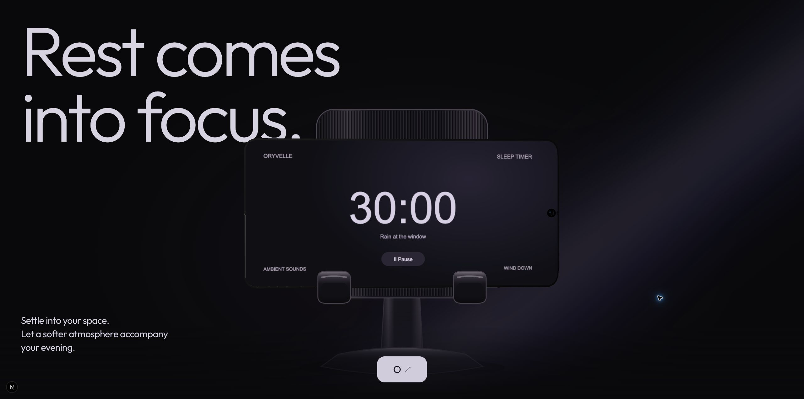
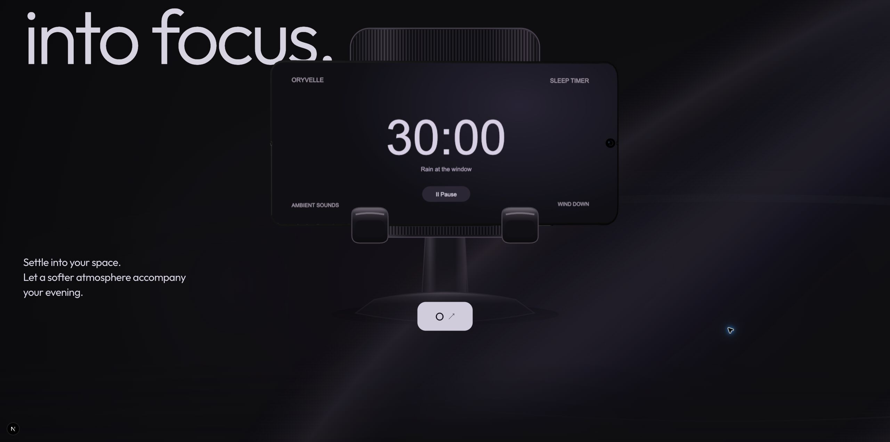
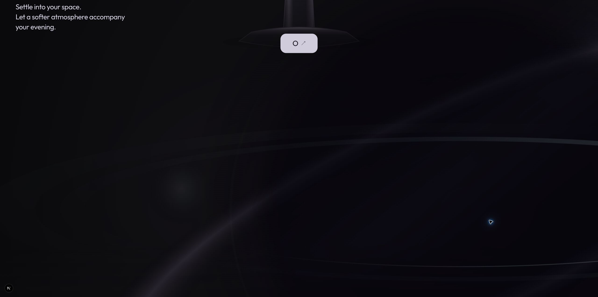
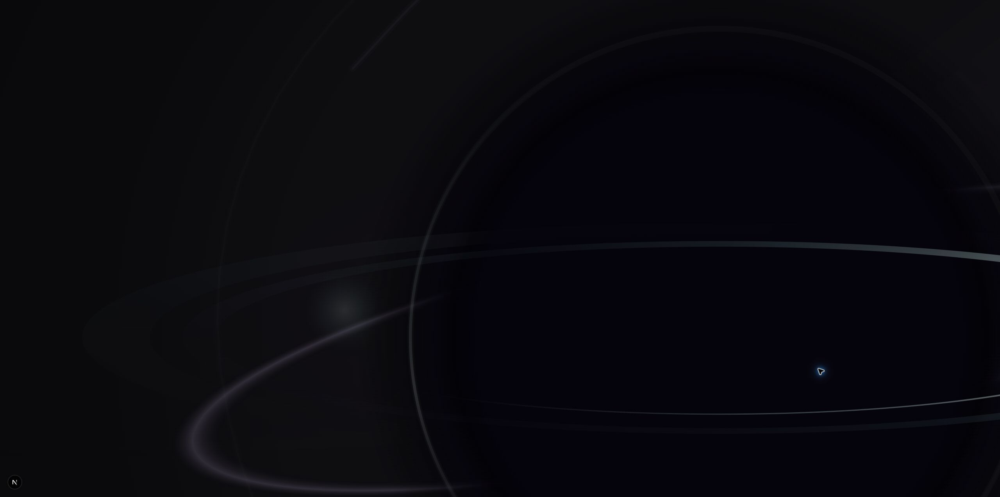
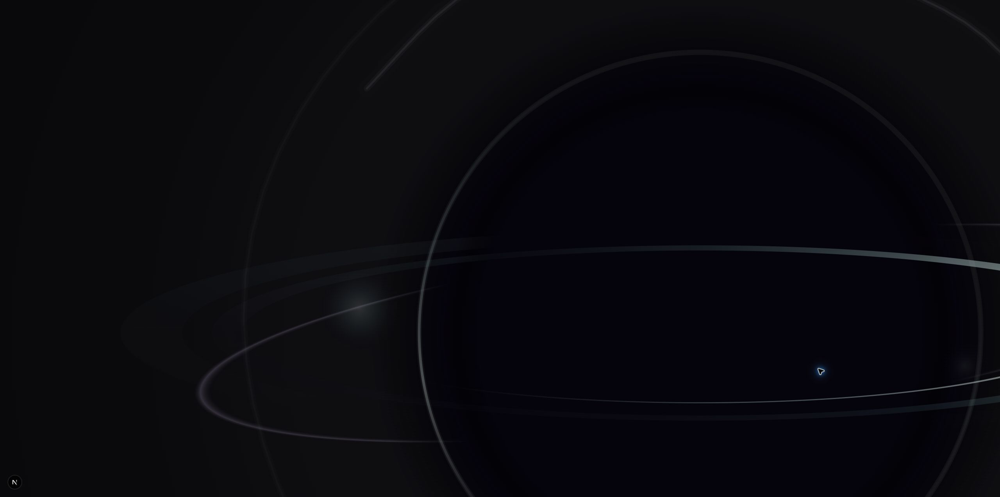
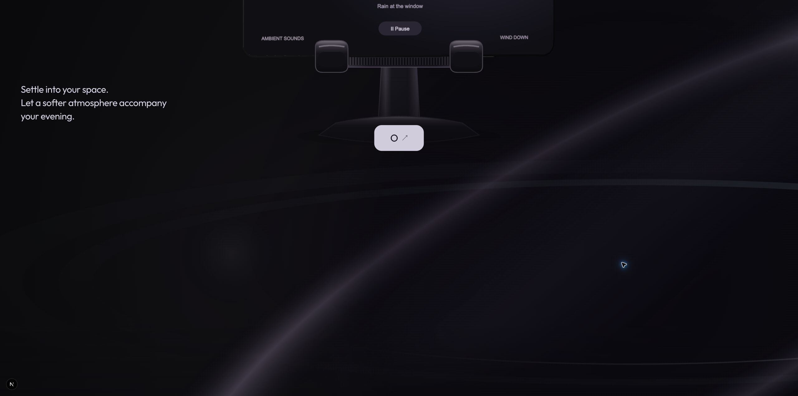
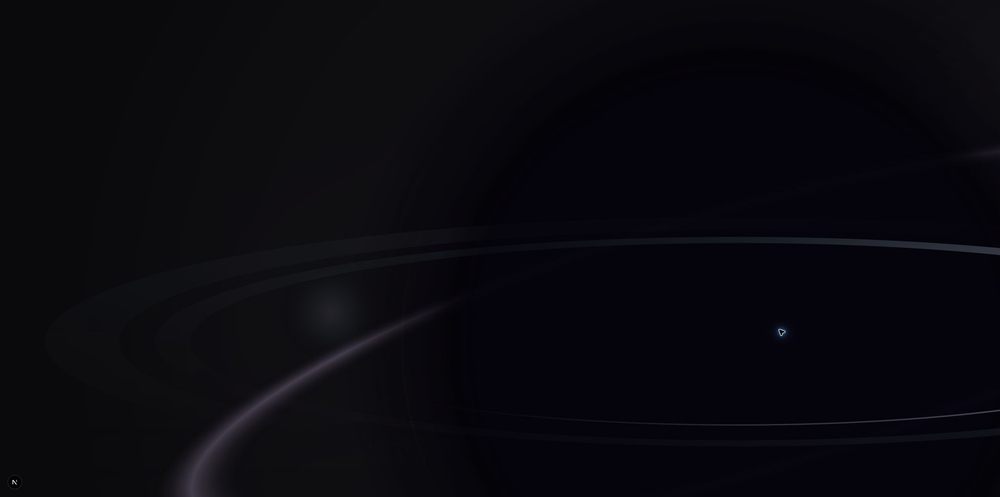
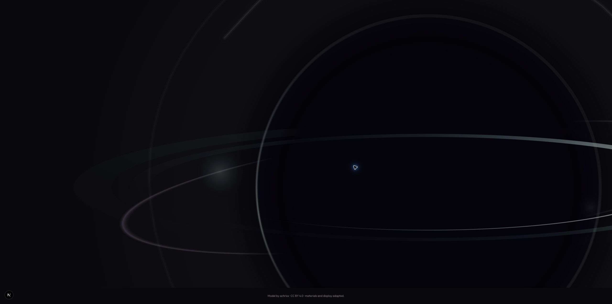
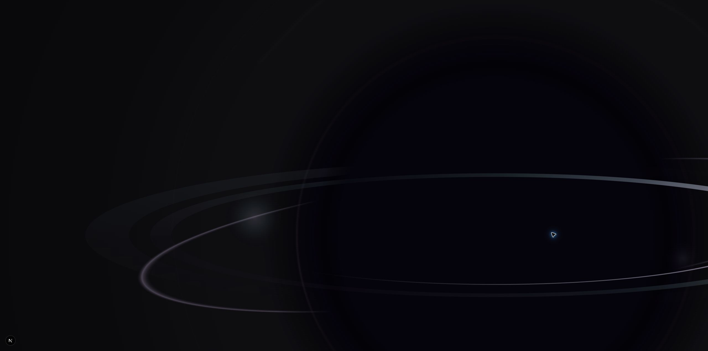

# Gate 04R.1 — Light-to-Orb Boundary Proof

Status: implemented for visual review. Creative acceptance remains pending. Review: http://localhost:3000/new

The proof stops at the first recognizable orb. No satellites, levels, timer, new Section 02 typography, navigation, or Section 03 were implemented.

## Preservation

Branch: `feat/flowty-fidelity-redesign`. Existing dirty working-tree work was preserved. No Android, master model, or dependency changes.

[Pre-edit hashes](captures/gate-04r1/source-baseline.json) record the baseline. The phone renderer, preparation, materials, camera, lighting, screens, float, entry, stand, supporting UI, pose definitions, and opening timeline remain unchanged. The original 660svh measurement range minus its 100svh stage still ends at **560svh** of scroll travel.

Integration changes are confined to the `/new` page, OpeningChapter wrapper/CSS, a new boundary component/state module, and an additive formation function in the existing orb renderer. The rejected mix/constellation chapter is no longer mounted. Its source, assets, research, and provenance remain isolated for evaluation.

## How the surviving light is carried

The original stand atmosphere now remains outside the departing hardware parent. The phone, rear stand, foreground handles, existing copy, and bottom anchor share one upward parent transform. Their contact relationship stays fixed. Hardware opacity is not animated.

A broad, low-intensity, complete elliptical light field overlaps the existing lavender atmosphere from the boundary's beginning. The original atmosphere gradually releases while this diffuse annulus bends, changes spread, and focuses. A dark core progressively occludes its rear contribution; front/rear ring separation and horizon light become readable around that darkness.

There is no stroke endpoint, dash-offset reveal, or line-tracing effect. Early geometry is larger than the viewport and mostly diffuse. Recognition comes from fragments and occlusion, rather than a complete orb crossfading into an empty scene. The near-black field stays continuous. No new headline interrupts the object-only interval.

This is editorial physical-to-abstract continuity, not a claim that the Android app literally performs this transformation.

## Ownership and staging

- Original opening GSAP timeline: approved phone pose, screen changes, stand choreography, and child lighting transforms. Keyframes/thresholds are untouched.
- One downstream GSAP timeline: normalized boundary progress, supported-assembly parent translation, and persistent-atmosphere parent opacity.
- Orb Canvas 2D: drawing only, from boundary progress.
- R3F: existing phone rendering and approved ambient behavior.
- React: lifecycle/failure state only; no per-frame state updates.

The outer journey is 840svh: original 660svh opening range plus **180svh boundary travel**. Its sticky stage remains 100svh. Boundary begins at the original 560svh endpoint and ends at 740svh total travel.

The hardware parent moves to yPercent -118, smoothly completing at local progress .62. It does not change the underlying supported pose. GSAP context cleanup reverts parent transforms and removes the boundary trigger. ResizeObserver updates Canvas size and disconnects on cleanup. Function-based start/end measurements refresh on resize. Actual renderer failure rebuilds the boundary measurements for the shorter static-opening range.

Context7 guidance consulted: [GSAP context](https://gsap.com/docs/v3/GSAP/gsap.context/) and [ScrollTrigger refresh](https://gsap.com/docs/v3/Plugins/ScrollTrigger/refresh/). No new animation library was added.

## Formation phases

| Local progress | State |
|---|---|
| 0 | Approved stand; residual illumination starts underneath. |
| 0–.14 | Broad lavender annulus overlaps the persistent original field. |
| .04–.78 | Whole light field bends and focuses; most geometry remains cropped. |
| .16–.72 | Dark core occludes rear light; an object becomes inferable. |
| .30–.92 | Horizon and front/rear ring separation become legible. |
| .62–1 | Hardware is clear; dominant asymmetric orb finishes forming. |

The original atmosphere parent releases over 0–.68. Formation channels are smooth deterministic functions of local progress. Reverse scrolling reconstructs the same light, dark core, atmosphere, and supported assembly.

Final desktop center is approximately 70% viewport width / 67% height, with oversized right/bottom cropping. Narrow layouts shift the center farther right and adapt radius to height. There is no text/object split or final Section 02 composition implied.

## Five same-viewport captures

All five use **2560 × 1273** CSS pixels and native Brave scrolling on the final implementation. [Checkpoint coordinates](captures/gate-04r1/checkpoints.json) are retained. Approximate local phases: 0, .167, .378, .600, .961.

### Settled stand — scroll 7129

### Early residual light — scroll 7511

### Ring fragment — scroll 7994

### Partial orb — scroll 8504

### Recognizable orb — scroll 9331

These checkpoints supplement continuous forward/reverse review; they are not the creative acceptance test by themselves.

## Attribution, clipping, accessibility

The 75svh empty credit region is replaced by compact attribution with a 64px minimum and wrapping/padding. Existing attribution/license links remain accessible.

The stage uses overflow: clip, preserving cropping without an internally scrollable stage when descendants receive focus. The assembly clips its descendants so the large static fallback poster cannot spill back into view after exit. Native document scrolling and the hidden scrollbar remain intact.

The Canvas is decorative; its wrapper supplies an accessible description. No new controls or focus trap were introduced.

## Reduced motion and failure paths

- Reduced motion was verified using Brave media emulation: static opening followed by a static orb in normal flow, 100svh each. No boundary scrub or autonomous Canvas loop.
- Opening fallback preserves the prepared poster and uses the shorter static range before downstream formation.
- Actual WebGL context loss was tested with the existing development control: poster activated, WebGL canvas removed, boundary measurements rebuilt; entry did not restart.
- Orb capability detection selects a lightweight CSS dark-core/elliptical-light fallback when Canvas support is unavailable. Development `?orbFallback=1` forces this path.
- Combined `?poster=1&orbFallback=1&debug=1` was tested: clean hardware exit and usable fallback orb.

The CSS fallback is representative and intentionally less rich than Canvas. Debug datasets and forcing switches are development-only. The GLB, Blender master, licenses, previous orb implementation, and provenance remain preserved.

## Rendering and overlap measurements

Canvas DPR is capped at **1.5**. It redraws on boundary progress or resize only. No new RAF, autonomous orbit animation, GSAP ticker callback, shaders, render targets, or per-frame texture allocation.

Both canvases remain mounted for reverse continuity. Mounted, visible, and continuously rendering are different states: the phone retains its existing demand/float lifecycle, and stand contact suppresses float. The boundary does not continuously invalidate the phone.

[Measured samples](captures/gate-04r1/overlap-measurements.json), wide desktop at actual DPR 1:

| Progress | WebGL viewport intersection | Phone frame counter | Canvas CPU draw submission |
|---|---|---|---|
| 0 | Full viewport | 504 | Initial sample |
| .1999 | Bottom at 905px | 505 | .70ms |
| .4500 | Last 48px intersects | 506 | .40ms |
| .5334 | Fully above viewport | 508 | .30ms |

The exit curve clears the WebGL canvas rectangle at approximately .466: **0.84 viewport heights / 1068px** of dual-canvas viewport overlap at this size. Direct samples bracket clearance between .45 and .5334. The physical phone silhouette can leave sooner than its full canvas rectangle.

This is scroll distance, not wall-clock duration. CPU drawing submission samples are not GPU/FPS measurements. Phone diagnostics remain **32 draw calls / 12,499 triangles**. No battery, GPU-memory, FPS, mobile-performance, or Core Web Vitals improvement is claimed. Both resident renderers retain a memory cost.

## Browser validation

Brave tests performed:

- Full approved opening into stand and downstream proof.
- Small forward wheel increments; normal and large/fast scroll input.
- Rapid reversals and return to the original supported stand.
- Final-code reverse/forward pass with unchanged contact relationship.
- Resize: wide 2560×1273, 1440×900, short 1440×650, tablet 820×1180, mobile 390×844.
- Actual reduced-motion emulation.
- Actual context loss; poster fallback; orb fallback; combined fallback.

Mobile/tablet retain the same 180svh boundary travel in this proof. This is not approval of final mobile Section 02 pacing. Reduced motion is normal flow.

Responsive screenshot clipping proved unreliable in the automation surface; native Brave captures established this was a capture artifact rather than a miniaturized orb. The five acceptance captures above use the native full viewport without viewport overrides. Supplementary native mobile/reduced-motion evidence remains in the capture folder.

## Automated checks

- Lint: passed.
- TypeScript: passed.
- Complete suite: **7 files / 43 tests passed**.
- Two focused boundary tests cover endpoint preservation and deterministic direction-independent formation.
- Production build: passed; `/new` prerenders.
- Git diff check: passed.

## Remaining review decisions

Creative acceptance is pending: inspect whether light becoming an object feels continuous, rather than reading as separate effects. This proof intentionally stops at an object-only orb. CSS fallback has less visual richness. Narrow boundary travel may merit a separately approved pacing adjustment later. Both canvases remain resident for reverse travel. Rejected constellation code remains isolated pending replacement approval.

Implementation stops here for visual review.

## Visual calibration — approved boundary, restrained ring hierarchy

The boundary concept was approved; this follow-up changes only drawing material/opacity in `drawOrbFormation`. A fresh [source baseline](captures/gate-04r1-calibration/source-baseline.json) confirms that `orb-renderer.ts` is the only changed implementation file. The opening, boundary timeline/state, ownership, geometry, cropping, backgrounds, CSS, fallbacks, and progress thresholds are unchanged.

Diagnosis: the diffuse annulus peaked at only .095 alpha initially, leaving insufficient local light as the original atmosphere released. Independently, the photon circle and multiple lensing arcs competed with the principal flattened disk.

Corrections:

- Local surviving annulus peak alpha now interpolates .27 → .36 (previously .095 → .24). The broad background radial illumination is unchanged. No global exposure or scene brightening.
- Boundary-only accretion palette uses pale lavender highlights, muted violet, and restrained cool teal. The near-black core is unchanged. Rear/front disk strengths .90/.88 (previously .65/.78) add local material separation.
- Circular lensing passes receive .18 of their previous opacity. Photon contour strength .07 (previously .40). Their positions and geometry remain unchanged; they now act as quiet accents behind the flattened bands.
- The old `drawMixOrb` and shared drawing helpers remain unchanged. No new passes, scheduler, resources, or dependencies.

Brave validation on 2560×1273: reload/entry, supported stand, incremental forward scroll through the departing assembly and residual trace, ring fragments, recognizable orb, reverse back through the trace into the stand, and a fast forward return. The localized light remained readable in the inspected middle states, and the final circular outline became substantially subordinate. Creative calibration is ready for user review. Responsive/reduced/failure suites were not repeated for this drawing-only change; their lifecycle and geometry code remain byte-identical.

Lint, TypeScript, all 43 tests, production build, and diff check passed. Drawing pass count and render-loop ownership are unchanged; no new performance benchmark is claimed.

### Calibrated middle and fragment

### Final object comparison

Stopped after visual calibration. No typography, satellites, mix data, or timer added.
