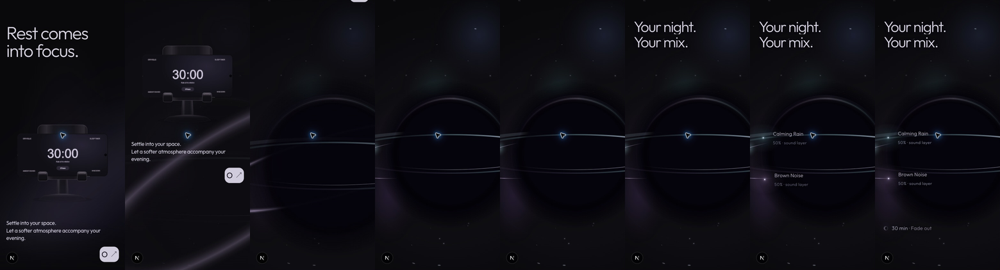
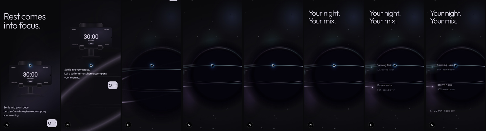
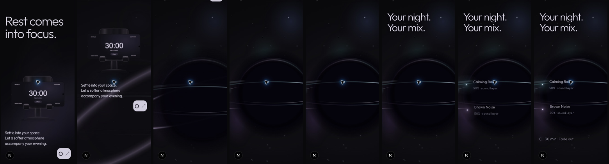

# Gate 04R.4 — Mobile Boundary & Orb-World Continuity

Review: http://localhost:3000/new

Scope: mobile at widths up to and including 760px. Section 01's authored poses, screens, lighting, materials, entry, stand and opening timeline remain untouched. Desktop/tablet retain their existing boundary and world choreography. Section 03 is not implemented.

## Diagnosis from the live browser

Inspected Brave at 390×844 and 320×720 before editing, using native scroll and read-only DOM geometry. The defect was staging, not a missing orb asset.

| Measured baseline | 390×844 | 320×720 |
| --- | ---: | ---: |
| Supported assembly / boundary starts at document Y | 4,726px | 4,032px |
| Incoming world starts at document Y | 6,246px | 5,328px |
| Boundary travel | 1,519px / 180svh | 1,296px / 180svh |
| World section height | 899px | 820px |
| Canvas height | 844px | 720px |
| Available canvas sticky travel within that section | 55px | 100px |
| Normal-flow headline starts at document Y | 6,684px | 5,702px |

The assembly exit finishes at 62% of boundary progress. This reserved about 577px / 492px of additional boundary travel after the outer assembly had completely exited. The boundary drew only the formation, while the stars/nebula were exclusive to the incoming world. Mobile's original recognition geometry placed the center at 85% of viewport width with a radius of at least 67% of viewport height, leaving a disproportionately cropped object. The world then presented a one-screen canvas with very little sticky travel and normal-flow copy starting 52svh down. These independent reservations produced the perceived dark separator.

The prior revision removed the forced 220svh minimum but did not solve this relationship. Shortening the old minimum alone was insufficient.

## Correction

### Mobile boundary

- Opening range stays **660svh**, so its authored scroll travel remains **560svh**.
- Mobile journey becomes **750svh**, yielding **90svh** boundary travel instead of 180svh. Only the post-settlement reservation changes.
- Supported assembly exits through its existing outer transform. Phone and stand remain together; the phone's own pose is not animated by this boundary.
- Formation reaches its recognizable endpoint by 86% of the shorter boundary.
- Mobile nebula/stars begin during formation: smooth progression from boundary progress .04 to .70.
- The existing boundary canvas draws the cosmic field behind its core/rings. No additional canvas, scheduler or scrolling library is introduced.
- Mobile formation uses a dedicated composition: endpoint center at 60% width / 57% height, radius `max(72% width, 46% height)`. It is substantial and cropped, with a much more legible black center and both ring passes.
- The starting trace uses a shorter mobile radius (`max(92% width, 82% height)`), keeping its lavender light inside the viewport while it curves into the ring.

### Mobile world

- **190svh total section height**, including one **100svh sticky stage** and **90svh useful story travel**.
- The former mobile normal-flow stage/overlap layout is replaced with this compact, bounded responsive branch of the existing downstream timeline. There is no new progress owner or repeated pin/unpin.
- Boundary endpoint and incoming world share mobile geometry, palette/radiance, star positions and nebula cache generation. The incoming stage stays hidden until its progress is positive, preventing it from covering the final boundary early.
- The cosmic field is already established at world progress zero. No second atmospheric entrance delays the story.
- Mobile type, sounds and timer occupy readable vertical positions over the same viewport world, rather than sitting below an expired backdrop.

| Mobile world progress | State |
| --- | --- |
| 0–.12 | Object-only hold |
| .12–.23 | Your night. |
| .25–.37 | Your mix. |
| .38–.55 | Calming Rain |
| .52–.70 | Brown Noise |
| .69–.79 | Both 50% annotations |
| .82–.92 | 30 min · Fade out |
| .80–.97 | Existing gentle ambient settling |

The scene retains one additional short viewport of narrative travel, rather than immediately dumping all information into normal flow or reproducing the desktop 260svh world sequence.

## Measured revised geometry

Native scroll rounding accounts for approximately one pixel of variation between forward and reverse positions.

| Viewport | Stand Y | Boundary travel | World recognition Y | World story travel | Timer capture Y |
| --- | ---: | ---: | ---: | ---: | ---: |
| 390×844 | 4,726 | 760 | 5,486 | 760 | 6,237 |
| 375×812 | 4,547 | 731 | 5,278 | 731 | 6,001 |
| 360×800 | 4,480 | 720 | 5,200 | 720 | 5,912 |
| 320×720 | 4,032 | 648 | 4,680 | 648 | 5,321 |

The incoming world canvas remains at viewport top throughout its story travel. It does not scroll away before the typography or timer. There is no extra post-story empty reservation.

## Ownership and lifecycle

- Original opening timeline: unchanged authored phone/DOM choreography.
- Boundary timeline: outer supported assembly exit and formation only. Responsive setup uses GSAP matchMedia with automatic reversion.
- World timeline: subsequent type, sounds, annotations and timer; mobile timing is a branch of that timeline.
- Canvas: drawing only. Optional `mobileComposition` leaves default desktop/boundary draw parameters unchanged.
- Sound-star child transforms: existing additive ambient movement, independent of scroll-owned parents.
- React: readiness/failure lifecycle only; no per-frame React updates.

Consulted [GSAP matchMedia documentation](https://gsap.com/docs/v3/GSAP/gsap.matchMedia()) and [ScrollTrigger refresh guidance](https://gsap.com/docs/v3/Plugins/ScrollTrigger/refresh()) through Context7. Media contexts revert automatically and the returned component cleanup reverts the owning matchMedia instance.

## Rendering and performance observations

- Same phone WebGL canvas plus existing boundary/world Canvas 2D elements.
- Boundary atmosphere uses a cached, resize-generated nebula and 38 seeded mobile stars. It paints on scroll/resize, without an autonomous boundary loop.
- World ambient eligibility now requires positive chapter progress on mobile as well as desktop. During the entire measured mobile boundary, debug state remained `static`; it switched to `ambient` only after the handoff.
- Existing visibility, hidden-document, reduced-motion and renderer-unavailable guards remain in place. No additional RAF/ticker is introduced.
- Sampled mobile boundary paints were approximately .3–.6ms in this desktop Brave session. This is not a mobile-device benchmark or FPS guarantee.
- DPR cap remains 1.5 for both Canvas 2D renderers.

## Validation

### Forward/reverse

Brave viewport overrides: **390×844, 375×812, 360×800, 320×720**. Inspected supported assembly, residual trace, ring, recognizable orb, cosmic field, type, sounds and timer. Captures were refreshed from fully initialized page loads to avoid confusing a resize artifact with the intended phone pose.

- No sampled viewport was an empty separator: the departing hardware/trace, forming ring or established orb remained legible.
- Both sound names/levels and timer remain readable at 320px.
- No horizontal overflow at the four sizes.
- Reverse traversal removes timer, levels, sounds and typography and reconstructs the ring/trace/assembly.
- Fine-grained 390px traversal used 20 native scroll increments of 42–43px. Boundary progress advanced continuously through zero to one; world progress remained zero until recognition.
- Rapid forward/reverse traversal returned to the boundary without overlapping text or an exposed blank incoming stage.

Raw measurements: [forward/reverse matrix](captures/gate-04r4/validation-measurements.json), [fine scroll traversal](captures/gate-04r4/slow-scroll-measurements.json).

### Fallback/reduced motion

- Forced opening poster and orb fallback: loader released; static orb and complete timed story remained usable. No ambient drawing in the unavailable renderer. CSS fallback remains a deliberately lower-fidelity representation.
- DevTools `prefers-reduced-motion: reduce`: confirmed actual matching media query, renderer fallback, world progress one, static render state and all seven reveal elements at opacity one. Complete content is available without the scrub sequence.
- Reduced-motion emulation was restored to normal afterward.

### Desktop/tablet preservation

- 1440×900: original 840svh journey, 740svh recognition point and 360svh world.
- 900×1000: same desktop/tablet ownership and distances; no horizontal overflow.
- Default boundary drawing regression test remains passing.
- Phone renderer, pose data, opening timeline, materials and lighting were not edited.

### Resize limitation outside this gate

During repeated live viewport resizing after the phone was already settled, the existing opening sometimes re-presented portrait content, and once a portrait pose, while the stand/DOM remained settled. Fresh loads at each requested size show the correct landscape phone and 30:00 screen. The frozen opening implementation was not changed to address this separately observed lifecycle issue. Boundary/world responsive geometry and progress recreation remained correct. Do not interpret this report as certifying the existing phone's resize lifecycle as flawless.

Console: no new captured error messages. Existing `THREE.Clock` deprecation warnings remain; they originate in the existing renderer/library path.

## Captures

Each row runs: supported stand → residual trace → ring → recognizable orb → established field → typography → sound-stars → timer. Individual PNGs retain the original viewport dimensions; contact sheets are resized for comparison. Cursor highlights and the Next development badge are browser/development chrome.

[390px stand](captures/gate-04r4/390-stand.png) · [trace](captures/gate-04r4/390-trace.png) · [ring](captures/gate-04r4/390-ring.png) · [orb](captures/gate-04r4/390-orb.png) · [field](captures/gate-04r4/390-field.png) · [type](captures/gate-04r4/390-type.png) · [sounds](captures/gate-04r4/390-sounds.png) · [timer](captures/gate-04r4/390-timer.png)

[Static fallback](captures/gate-04r4/390-fallback.png) · [Reduced motion](captures/gate-04r4/390-reduced.png) · [Desktop world](captures/gate-04r4/1440-world.png)

## Engineering checks

- ESLint: passed.
- TypeScript: passed.
- Existing tests: 8 files, 44 tests passed.
- Production build: passed.
- Git diff / modified-source whitespace checks: passed.

Baseline file hashes were recorded before editing in [before-hashes.json](captures/gate-04r4/before-hashes.json). OpeningChapter and boundary-state remain byte-identical to that snapshot. Shared drawing changes are opt-in mobile geometry, with unchanged default desktop parameters.

## Review outcome

Mobile now has a continuously legible transformation and short world narrative instead of a late separate cosmic section. Visual approval remains with the user. No desktop art-direction change, opening pose adjustment, new navigation, library or Section 03 work was made.
