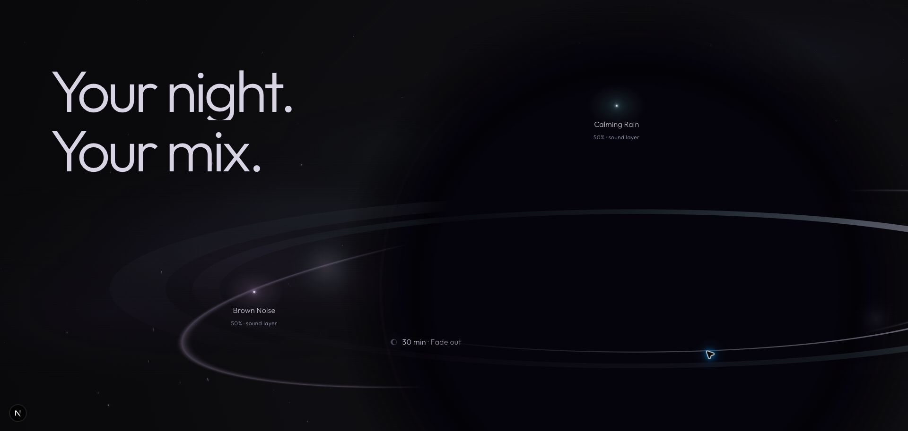

# Gate 04R.3 — Orb World Art Direction Revision

Implemented for visual review. Review URL: http://localhost:3000/new

## Before → after

Gate 04R.2 established the narrative but read as an isolated object with circular avatar badges and detached level metadata. This revision gives that object a surrounding night field, changes the sounds into selected luminous points, places each level with its own name, and brings the timer nearer the foreground ring. The orb still dominates; the new richness comes from depth and selective light rather than additional modules.

The copy remains **Your night. / Your mix.** No unsupported product claims, interactive mixer, constellation paths, cards, navigation, or Section 03 were added.

## Frozen structure

Branch: `feat/flowty-fidelity-redesign`. Existing working-tree changes preserved. No dependency, Android, source model, opening asset, or phone-renderer edits.

[Pre-edit SHA-256 baseline](captures/gate-04r3/source-baseline.json) records all landing source and `/new`. Only these pre-existing implementation files changed:

- `OrbWorld.tsx`: draws atmosphere in the existing Canvas; replaces avatar markup with sound lights; reveals level spans together using the existing level phase.
- `orb-world.module.css`: selected-light appearance, attached annotations, timer placement, subtle normal-flow atmosphere.
- `orb-renderer.ts`: optional downstream contour strength, defaulting to 1. Boundary calls do not supply it and retain identical drawing behavior.

New: `cosmic-field.ts`, a small Canvas-only atmosphere helper. Opening/entry/phone/material/camera/float/stand/supporting UI files, boundary component/state/CSS, and all preceding timeline definitions remain byte-identical to baseline.

The 840svh opening journey, 180svh boundary, orb endpoint geometry, 360svh downstream chapter / 260svh travel, and narrative timings are unchanged. No new ScrollTrigger or animation scheduler.

## Exactly what changed visually

1. A sparse, deterministic far field emerges behind the orb: 84 small points on desktop/tablet, 38 on mobile. Many are naturally occluded by the core; these are generated points, not a dense particle field.
2. Six overlapping anisotropic lavender/teal/blue washes introduce restrained nebula light. They remain dark and leave the editorial region readable.
3. Nearby background points bend slightly in angle and elongate tangentially around the implied horizon. The black core masks the field, creating optical depth.
4. Once the world establishes itself, large circular contour accents diminish to 35% of their original strength. The black core and flattened front/rear accretion ring retain their scale, position, material treatment, and crop. The approved boundary’s contours are unchanged.
5. Circular sound-cover badges become two selected sound-stars: a tiny pale core, localized teal halo for Rain, lavender halo for Noise. No UI frame, selected-state circular control, or constellation line.
6. `50% · sound layer` appears directly beneath each sound name in the existing level phase. The separate lower-left two-row level block is removed.
7. `30 min · Fade out` moves from a low metadata-like location to the near-side ring region (43% x / 78% y desktop, 45% / 80% tablet), with a quiet moon-like light cue. It remains text, not a timer control/card.

The real sound assets remain in the repository for provenance and other evaluation work. This chapter no longer requests their images. Its sound-star representations are editorial translations of the verified Calming Rain and Brown Noise mix, not literal Android UI.

## Boundary continuity

At downstream progress zero, cosmic strength is zero and optional contour strength is 1. The incoming frame therefore preserves the approved recognized orb. The new field grows smoothly over the first 20% of the existing world progression, independently of the earlier boundary. The object-only interval remains 0–9%; no new type or sound enters it.

Canvas order: approved orb drawing → far-field points and cached nebula using `destination-over` → near-black base. Consequently stars/light sit behind the physical-looking core rather than painting a galaxy texture across its black center. No fade of the orb, cut, recentering, or scale change.

## Space / distortion strategy

`cosmic-field.ts` builds a deterministic point set once per resize and caches the nebula in a detached Canvas. It does not create another visible Canvas, WebGL context, shader, render target, or raster wallpaper.

The horizon relationship reuses the established orb center/radius formulas. A localized Gaussian influence changes point angles by approximately .035 radians at its strongest location and elongates their tiny footprints tangentially up to 3.8 times the base radius. A tiny .0015-radian variation brings that refraction to life.

This is an artistic Canvas optical cue, **not a physically accurate gravitational lens simulation or pixel-displacement shader**. It provides restrained surrounding-space response within the approved lightweight architecture. No extra circle/stroke is drawn to explain the effect.

## Sound-star semantics and motion

Calming Rain and Brown Noise remain the same verified sounds. Their light cores, names, and levels form one entity. Figures/figcaptions provide semantic association; decorative light elements are hidden from assistive technology. They are not clickable, fake sliders, or live audio controls. The 50% values are editorial example levels, not a claim that an app mix is playing in the browser.

The existing shallow entrance paths and child drift are unchanged:

- Rain: parent +68px / −35px, scale .78 → 1, 37–54%.
- Noise: parent −76px / +42px, scale .78 → 1, 53–71%.
- Both level spans: 72–82%, using one existing phase and owner.
- Timer: 84–94%; existing settlement remains 80–97%.

The timeline still owns the parent transforms. The existing ambient callback owns only child offsets and light intensity. The names and levels move with their corresponding light.

## Ambient behavior

Existing orb material phases, ±1.8% illumination breathing, and independent small sound drift remain intact.

New motion uses the same elapsed clock / ticker:

- Far stars shimmer by ±16% of their already faint alpha, with varying periods approximately 25–65 seconds and independent phases.
- Nebula drift: x ±6px, nominal period ~195s; y ±4px, ~270s. No full-field spin or obvious repeating travel.
- Horizon angular variation: ±.0015 radians, ~82s, localized to nearby points.
- Selected-light intensity: .92 ± .08; Rain ~55s, Noise ~65s with separate phase.

Settlement slows the shared ambient clock to 45% and reduces sound drift to 28%, as before. Far-field strength softens by 12%; star strength by 14%. The scene stays quietly alive. No shooting star was added: it did not justify another focal event in this sequence.

## Reduced motion, responsive, fallback

Reduced motion uses the existing complete normal-flow story and static orb. Cosmic drawing uses elapsed zero; no shimmer/drift tick runs. Both names/levels and timer remain visible. Testing confirmed `reduced:true`, `renderState:static`, progress 1, and an unchanged paint counter (257) across subsequent inspection.

Mobile ≤760px remains normal flow: oversized orb → editorial copy → sound lights/names/levels → timer. It has 38 far stars and a faint static wash behind the subsequent story. No desktop pin was introduced. Tablet keeps the existing spatial arrangement; desktop/short desktop retain generous separation.

Explicit opening-poster + orb-fallback validation retained complete content and reversible reveal phases. The CSS fallback gets a faint localized violet atmosphere, while the sound lights remain native CSS. It is intentionally less rich than the Canvas far field and does not run ambient drawing. Tested fallback state: active true, static render state, local progress .9423.

## Performance and ownership

- One existing world Canvas; one **detached nebula cache**, created on resize only, not every animation frame.
- Cache width capped at 1024px and proportional height. A 2560×1337 world implies a ~1024×535 RGBA cache (~2.2MB theoretical pixel storage); tablet 820×1180 implies ~3.9MB. These are storage estimates, not measured total browser memory.
- 84/38 stars are a bounded array; no particle simulation or continual object allocation for geometry.
- Visible drawing still uses the existing GSAP ticker, nominal cap 30 paints/s and a lower effective rate at settlement. No RAF or library added.
- Offscreen/hidden/reduced/unsupported eligibility and symmetrical ticker/listener/observer cleanup remain in place. The owned cache backing dimensions are explicitly cleared on unmount.
- Debug Canvas submission samples were approximately 0.1–1.2ms during inspection (including a resize sample). They do not measure GPU raster/compositing, FPS, battery, or total memory. No claimed Core Web Vitals gain.
- No new fetched imagery. The two previous 81px avatar image requests are no longer needed for this chapter; their files are retained.

Context7 skill consulted for the installed GSAP architecture: [matchMedia conditions and cleanup](https://gsap.com/docs/v3/GSAP/gsap.matchMedia/). Existing `gsap.ticker.add/remove` ownership is retained.

The prior browser-automation hidden-tab verification limitation remains: the session can keep a page logically visible. Actual hidden-tab suspension is not newly claimed as browser-verified in this gate.

## Validation

Live Brave review included:

- Refresh / entry / hero and native scrolling into the revised world.
- Object-only hold, both typography phases, individual sound entrances, attached levels, timer endpoint.
- Slow phase steps, large forward/reverse wheel input, return through recognized orb to the approved stand/boundary.
- Normal wide viewport (~2560×1337), 1440×900, short 1440×650, tablet 820×1180, mobile 390×844.
- Resize and fresh responsive reloads. Recorded document/viewport widths matched at 1440 and 390; no horizontal overflow.
- Reduced-motion and explicit opening/orb fallback branches.
- Existing native scrolling and hidden scrollbar preserved.

Current DevTools console contains existing local manifest origin/scope warnings and the pre-existing Three.Clock deprecation warning. No new cosmic-field runtime error was observed. The entire frozen boundary remains covered by the existing drawing-contract and state tests.

## Captures

| Checkpoint | Capture |
|---|---|
| Pre-revision endpoint | [Before](captures/gate-04r3/00-before.jpg) |
| Object-only hold (~4%) | [Hold](captures/gate-04r3/01-object-hold.jpg) |
| Typography (~31%) | [Type](captures/gate-04r3/02-typography.jpg) |
| Sound arrivals (~62%) | [Sounds](captures/gate-04r3/03-sound-arrivals.jpg) |
| Associated levels (~81%) | [Levels](captures/gate-04r3/04-levels.jpg) |
| Timer / settled field (~96%) | [After](captures/gate-04r3/05-timer.jpg) |
| Final clean route (1920×913) | [Review](captures/gate-04r3/final-review.jpg) |
| Approved stand | [Stand](captures/gate-04r3/06-approved-stand.jpg) |
| Approved boundary | [Boundary](captures/gate-04r3/07-approved-boundary.jpg) |
| Desktop 1440×900 | [Desktop](captures/gate-04r3/desktop-1440.png) |
| Short desktop | [Short](captures/gate-04r3/short-desktop.png) |
| Tablet | [Tablet](captures/gate-04r3/tablet.png) |
| Mobile orb | [Orb](captures/gate-04r3/mobile-orb.png) |
| Mobile story | [Story](captures/gate-04r3/mobile-story.png) |
| Reduced motion | [Reduced](captures/gate-04r3/reduced-motion.png) |
| Fallback | [Fallback](captures/gate-04r3/fallback.jpg) |

Responsive native captures include emulation/browser context and may show only the physical screen's visible portion of tall emulated viewports. Key desktop narrative captures use the same normal viewport, enabling direct sequence comparison.

## Checks

- ESLint: passed, no warnings.
- TypeScript: `tsc --noEmit` passed.
- Tests: 8 files, 44 passed.
- Production build: passed.
- `git diff --check` and new-source whitespace checks: passed.

## Final visual review notes

The field is deliberately faint; the selected sound lights are the nearest, clearest points. The orb retains the largest visual mass. Review continuously from the supported phone through recognition into the new field, rather than judging a brightened still image. Creative approval of cosmic density, optical cues, and sound-star semantics remains pending. Lensing is an editorial approximation, and the static fallback remains lower fidelity. Section 03 has not been started.

## User-directed visibility and mobile revision

The earlier captures and check results above describe the previous revision, not this calibration. The user explicitly requested changes without testing and will perform the next visual review.

- Increased the cached lavender, blue and teal nebula washes, including their intermediate gradient stops, so the sky has a readable far field instead of nearly disappearing into black.
- Increased distant-star size/brightness without increasing the star count or introducing another animation loop.
- Added world-only radiance that rises from 1 to 2.8 through the existing atmosphere progression. It strengthens the flattened rear/front accretion material while keeping the central void dark.
- Added a softly layered, tapered upper lensing crown: an editorial approximation of the rear disk bent above the black center. This is a partial curved light band, not another complete orbital circle.
- The boundary renderer retains its original defaults. The added crown is absent and added radiance is zero at world progress zero; Section 01 and the boundary choreography are unchanged.
- Mobile/reduced-motion layout now keeps the one-viewport cosmic canvas sticky behind the normal-flow story. The story overlaps its lower portion instead of starting after the canvas. Removed the forced 220svh minimum, which produced a long empty dark region. No new mobile pin/timeline was introduced.
- Strengthened the static fallback atmosphere and ring to reflect the visibility direction.

No browser review, screenshots, automated tests, lint, TypeScript check, build or diff check were performed for this revision, as requested. Visual balance, mobile overlap, fallback appearance and runtime behavior remain pending user testing. Existing lifecycle guards and animation ownership have been retained; no new library, asset, canvas or scheduler was added. Section 03 remains untouched.
