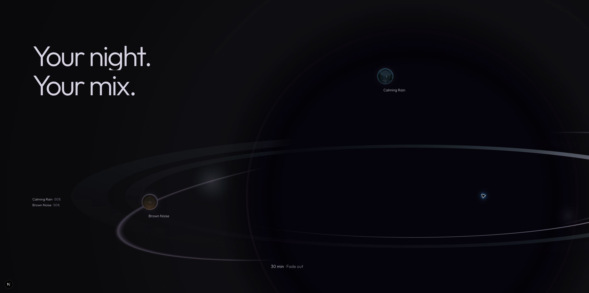

# Gate 04R.2 — Orb World Choreography

Status: implemented for visual review; creative approval is pending.
Review: http://localhost:3000/new

## Scope and preservation

The recognized cropped orb now continues through an object-only interval, two editorial lines, two real sound avatars, quiet mix annotations, and a timer callback. No Section 03, controls, cards, navigation, constellation, new dependency, or Android changes.

Branch remains `feat/flowty-fidelity-redesign`. Existing dirty work was preserved. [Pre-edit SHA-256 inventory](captures/gate-04r2/source-baseline.json) covers the opening, device, entry, boundary, rejected mix prototype, and route. Of those files, only `OpeningChapter.tsx` and `orb-renderer.ts` changed: the first imports/mounts the downstream chapter, the second accepts optional ambient parameters. All boundary state/CSS/component files, opening poses/timeline/CSS, phone geometry/material preparation, lighting, camera, float, screens, stand, entry, supporting UI, and route are byte-identical to the baseline.

The former mix/constellation prototype remains isolated and unmounted. Provenance and factual product research are retained.

## Ownership and continuity

- Gate 04R.1 retains its original normalized formation timeline and supported-assembly exit.
- `OrbWorld` owns one new downstream GSAP/ScrollTrigger timeline and CSS sticky viewport.
- That timeline owns reveal parent transforms and normalized narrative progress.
- Ambient drift owns only avatar child transforms. It never writes the parent choreography transforms.
- Canvas 2D draws the established orb plus tiny material-phase variation; it does not own scroll or DOM transforms.
- React owns refs, lifecycle, and Canvas availability only. There are no per-frame React state updates.

The existing 840svh journey/sticky stage is unchanged. Orb recognition still finishes at 740svh of travel. The new 360svh chapter overlaps the final 100svh viewport using a negative margin and supplies **260svh additional travel**. This is shorter than the opening's 560svh authored travel. There is one sticky world stage, no repeated pin/unpin, native scrolling, and no smoothing library.

The incoming world viewport is hidden until downstream progress becomes positive; it cannot slide over the approved boundary early. Its first draw uses the same formation function at progress 1, with zero ambient phase/settlement. The opaque near-black field is painted behind the transparent drawing using `destination-over`. Thus the underlying end-frame is covered by an equivalent end-frame, without a visible fade between separate objects, resizing, recentering, or a blank interval. Ambient phase ramps gently over the first 9%.

A regression test compares drawing-command streams at five boundary phases with absent ambient parameters versus explicit zero values. This protects the optional-parameter contract; it is not a pixel-perfect screenshot test against a historical browser render.

## Timeline

Local downstream progress, not opening/boundary progress:

| Progress | State |
|---|---|
| 0–9% | Recognizable oversized asymmetric orb; object-only hold. |
| 9–20% | `Your night.` reveals through opacity, 26px translation, and clipping. |
| 23–35% | `Your mix.` follows with the same restrained reveal. |
| 37–54% | Calming Rain travels shallowly from +68px x / −35px y, scale .78 to 1. |
| 53–71% | Brown Noise follows from −76px x / +42px y, scale .78 to 1. |
| 72–82% | Two quiet factual annotations: Calming Rain · 50%, Brown Noise · 50%. |
| 80–97% | Illumination and autonomous movement progressively settle. |
| 84–94% | `30 min · Fade out` appears as a callback to the supported phone. |
| 97–100% | Quieter living endpoint, then ordinary flow. No next chapter. |

State progress is linear; DOM entrances use `power2.out`, scrubbed directly without timed playback. Reverse scrolling removes timer, levels, avatars, and lines in the corresponding reverse order. Ambient elapsed time intentionally continues independently; reverse scrolling reconstructs authored narrative states rather than rewinding the living material phase.

## Art direction

The approved core, flattened rear/front ring, palette, oversized scale, and right/bottom crop remain dominant. Type occupies available upper-left negative space at a smaller hierarchy than the first hero (Outfit 300, pale lavender, maximum 124px). No object recentering/shrink was used to create a tidy column. Sound labels and 72px avatars remain subordinate. Rain sits upper/right; Noise sits lower/left near the foreground ring. Levels stay quiet in the lower-left; the timer is low and closer to the orb, rather than in a feature card.

Both sound images are the existing verified Android-derived `calming-rain.webp` and `brown-noise.webp`: 81 × 81 source images, **4,262 bytes combined**. No new artwork or fake UI. Levels are explicitly editorial annotations, not an interactive mixer or a live app state. The supported 30-minute fade-out is a product fact, not sleep detection.

## Ambient values and settlement

No planet rotation, object bobbing, scale pulsation, moving stars, or particles.

- Accretion phase: baseline .28 plus .006 sinusoidal variation, nominal 90-second period.
- Flow/highlight phase: baseline .34 plus .008 variation, nominal 71-second period.
- Illumination: ±1.8%, nominal 23-second period.
- Rain drift: x ±4px / y ±6px; periods approximately 44.6s / 33.9s.
- Noise drift: x ±5px / y ±5px; periods approximately 52.2s / 42.1s; distinct phases 1.6 / 2.1 radians.
- At settlement: ring strength reduced by 10%, drift amplitudes reduced to 28%, ambient clock rate reduced to 45%. Motion remains alive rather than switching off.

Periods refer to the unslowed clock. They lengthen during settlement. Material phase changes are deliberately tiny to avoid destabilizing the approved ring treatment. No global brightening.

## Responsive and reduced motion

| Layout | Behavior |
|---|---|
| >1050px | 260svh sticky progression, asymmetric spatial type/avatars. |
| 761–1050px | Same bounded sequence; smaller typography and adjusted avatar/annotation positions. |
| ≤760px | Normal-flow vertical story, no downstream ScrollTrigger or long mobile pin. Orb occupies the initial 100svh, followed by both lines, Rain, Noise, levels, timer. |
| Reduced motion | Same complete normal-flow content, static recognizable orb, no travel or autonomous animation. Existing opening static fallback remains in force. |

The mobile orb remains large and cropped. The desktop layout is not miniaturized. Resize media ownership uses `gsap.matchMedia`; its cleanup reverts timeline transforms before the normal-flow branch restores all reveals.

## Rendering and lifecycle

No extra requestAnimationFrame scheduler: ambient drawing subscribes to the existing **GSAP ticker**, only while the Canvas intersects, the document is visible, reduced motion is off, Canvas is supported, and the downstream chapter has begun (or mobile normal flow is active). Pauses preserve phase and resume without elapsed hidden time. Timeline updates request a draw only when ambient drawing is not already running.

Paint throttling is at most 30Hz. The settled slowed clock also reduces effective paint frequency. ResizeObserver sizes the backing surface with DPR capped at 1.5 and repaints once. Listeners/observers/ticker subscription and matchMedia context are removed on unmount. Fallback and reduced-motion branches do not retain an autonomous ticker subscription.

Two Canvas 2D elements are mounted at the handoff (approved boundary plus downstream world). The old boundary is scroll-driven only; only the visible world has ambient drawing. Existing phone WebGL remains mounted but idle after supported settlement. No shared renderer, additional WebGL, render target, or postprocessing was introduced.

Context7 guidance consulted for existing GSAP: [ticker subscription/removal](https://gsap.com/docs/v3/GSAP/gsap.ticker/), [context cleanup](https://gsap.com/docs/v3/GSAP/gsap.context/). Existing Canvas primitives remain reused.

### Measurements and limits

Debug-only DOM counters were inspected in Brave. At 2560 × 1273, world Canvas backing dimensions were 2560 × 1273 (DPR 1 on that display). Samples of synchronous Canvas command submission were 0.1–0.8ms. These do not measure asynchronous raster/composite cost, FPS, battery, or mobile GPU performance.

At local progress .9616, the counter advanced from 7 to 111 over 8.696 seconds: approximately **12 paints/second** at the softened endpoint. Before settlement, a sample advanced 6 to 156 over 5.884 seconds: approximately **25.5 paints/second** under browser automation. The nominal maximum is 30, not a claimed guaranteed frame rate.

Offscreen chapter reported `static`, with its paint counter remaining 1,600 across 44.8 seconds; reduced-motion counter remained 217 across subsequent inspection; forced Canvas fallback reports `static` and no autonomous paints. Existing phone output stayed at 1,200 frames between two orb-endpoint samples; its 32 draws / 12,499 triangles are unchanged phone renderer statistics, not Canvas drawing costs.

Hidden-tab validation has a limitation: switching to a blank Brave tab did not produce a document-hidden event in this automation session (no pause/resume markers were emitted), and drawing continued. The code checks `document.hidden` and removes its ticker on visibility change, but a genuine hidden-tab pause is therefore not claimed as browser-verified. This remains a manual verification item outside the focus-preserving automation session.

No production JS-transfer or memory benchmark was performed. New code is a small chapter/CSS module; real avatar files already existed. No new network-heavy assets.

## Browser validation

Brave live development route, continuous native wheel input plus checkpoint inspection:

- Refresh → entry → prepared hero → approved first/second turn → stand → approved residual-light formation → recognized orb → world sequence.
- Slow forward steps through both lines, each sound, levels, and timer; normal forward/reverse and large direction reversals.
- Reverse removes later narrative elements and returns to the object-only interval/boundary without transform competition.
- Desktop 1920×1080 and 1440×900; short 1440×650; tablet 820×1180; mobile 390×844.
- Mobile normal flow and large orb checked after resizing and fresh reload. An early matchMedia omission made the mobile stage hidden; the explicit mobile condition fixed it and was revalidated.
- Reduced motion via DevTools: opening fallback active, world normal flow, progress 1, all content present, no ambient paints.
- `?poster=1&orbFallback=1&debug=1`: opening static poster plus CSS orb fallback, complete semantic content and reversible downstream reveals, no ambient ticker. This exercises explicit fallback branches rather than physically disabling every Canvas implementation.
- Scrollbar remains hidden; no new scroll container or body lock.

Current DevTools console showed existing local manifest origin/scope warnings and the existing Three.Clock deprecation warning. No new orb-world runtime exception was observed on final reload. Earlier captured logs contain a transient missing-module error while the new file was being created; the file is now resolved, all final builds pass, and this is not a remaining error.

## Captures

The normal-viewport key checkpoints use the same 2560×1273 viewport. Responsive captures document composition; native mobile/reduced/fallback captures include browser/emulation context because the automation screenshot API can pad/scale overridden viewport output.

| State | Capture |
|---|---|
| Object-only hold | [01](captures/gate-04r2/01-object-hold.jpg) |
| Your night. | [02](captures/gate-04r2/02-your-night.jpg) |
| Your mix. | [03](captures/gate-04r2/03-your-mix.jpg) |
| Rain entrance | [04](captures/gate-04r2/04-rain.jpg) |
| Both layers | [05](captures/gate-04r2/05-both-sounds.jpg) |
| Levels | [06](captures/gate-04r2/06-levels.jpg) |
| Timer | [07](captures/gate-04r2/07-timer.jpg) |
| Final endpoint | [Final](captures/gate-04r2/final-review.jpg) |
| Wide desktop | [1920](captures/gate-04r2/desktop-1920.jpg) |
| Desktop | [1440](captures/gate-04r2/desktop-1440.jpg) |
| Short desktop | [Short](captures/gate-04r2/short-desktop.jpg) |
| Tablet | [Tablet](captures/gate-04r2/tablet.jpg) |
| Mobile orb | [Orb](captures/gate-04r2/mobile-orb.png) |
| Mobile story | [Story](captures/gate-04r2/mobile-story.png) |
| Reduced motion | [Reduced](captures/gate-04r2/reduced-motion.png) |
| Fallback | [Fallback](captures/gate-04r2/fallback.png) |

## Automated checks

- ESLint: passed, no warnings.
- TypeScript `tsc --noEmit`: passed.
- Vitest: 8 files, 44 tests passed.
- Production Next build: passed; `/new` statically prerendered.
- `git diff --check`: passed. New gate source files also checked separately for whitespace errors.

## Remaining review points

Creative approval of live pacing, subtle ambient life, avatar relationships, and the quieter endpoint remains with the user. CSS-only fallback is intentionally lower fidelity. Mobile uses all-content normal flow rather than desktop sequencing. Captures supplement continuous motion review; they do not prove creative continuity alone. Full production GPU/memory/device profiling is deferred. No Section 03 has been started.
