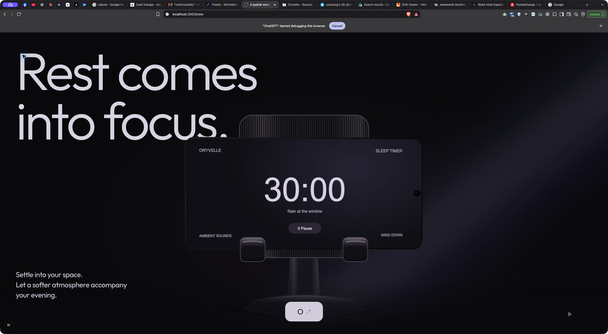

> Historical validation report. The phone resize fix remains active. Section 02 and the associated gate-04r5 captures were removed during the opening-only restoration; references below describe the former test session, not the current page.

# Gate 04R.5 — Responsive Resize / Lifecycle Cleanup

Review: http://localhost:3000/new

## Result and scope

Fixed the stale renderer state after resize: a restored landscape stand no longer retains a hero/portrait phone from refresh's intermediate rewind. Removed the related breakpoint-induced scroll reset. No intended visual changes, new library, timeout, reload workaround, manual scroll restoration or Section 03 implementation.

**One acceptance constraint remains:** a sufficiently large viewport-height change changes the chapter's normalized position at unchanged document scroll. Preserving both the existing viewport-based distances and document scroll cannot also preserve the previous narrative position. This is documented below rather than presented as a fully passing gate.

## Diagnosis / direct reproduction

Started from the fresh development `/new?debug=1` route, sought the supported-phone endpoint, resized, and read document scroll plus temporary renderer/controller diagnostics. Recorded the actual pivot values, semantic screen, controller registrations, responsive composition, stand styles, boundary/world progress and canvas bounds.

A delayed refresh at 360×844 / document Y 4,735 left:

- stand opacity 1, centered supported stand DOM;
- renderer yaw −.12, pitch .06, roll −.18: hero orientation;
- `portraitA`, ambient progress 0;
- opening side-effect progress 0 despite the restored stand DOM.

Crossing to desktop also reset document scroll to zero. Same-branch viewport changes recreated the renderer controller but did not always reproduce the failure. The controller was re-registering due to R3F viewport dependencies; the model/canvas was persistent. Controller registration alone was not the cause.

Temporary renderer diagnostics were removed after evidence collection. `PhoneCanvas.tsx` matches its pre-gate hash exactly. The evidence JSON records are diagnostic snapshots, not new production interfaces.

## Exact lifecycle ordering before

1. `narrow` state changed at the breakpoint.
2. `useGSAP` reverted/recreated the opening because `narrow` was a dependency. It reset mutable pose/progress to the hero checkpoint and applied `portraitA` before rebuilding.
3. ScrollTrigger refresh temporarily rewound the scrubbed animation. Its `onUpdate` side effect applied that temporary pose, semantic screen and float progress to R3F.
4. Refresh restored timeline/DOM state with callbacks potentially suppressed when progress was unchanged. There was no final renderer synchronization, leaving the rewind side effect visible.
5. Phone `.to()` tweens also relied on mutable target start values when invalidated.
6. Boundary/world `matchMedia()` callbacks performed individual `.refresh()` calls during collective media reconstruction. Inspection of installed GSAP 3.15.0 showed these calls can clear recorded scroll memory before the collective media refresh restores it. Removing them eliminated the measured Y→0 reset.

## Correction / ownership

### Opening lifecycle

- Responsive width no longer tears down the opening timeline. Its authored DOM keyframes are identical across widths; CSS already owns layout.
- Read current media eligibility when applying/registering the renderer instead of capturing `narrow` in a recreated callback.
- `onReady` is stable. A viewport-specific controller receives the current normalized pose and semantic screen, rather than a breakpoint-reset hero.
- Phone pose track uses explicit authored `fromTo` starts with `immediateRender:false`. Each segment retains exactly the existing destination, duration and monotone ease. Refresh cannot reinterpret a partially played mutable pose as its new starting value.
- Local `onRefreshInit`/`onRefresh` guards suppress renderer publication during measurement rewind. `onRefresh` explicitly publishes the restored timeline progress, screen and float strength, even when ordinary update callbacks are suppressed.

### Boundary/world lifecycle

- Removed the two individual refresh calls inside media callbacks. GSAP's existing collective media refresh handles measurement/restoration once the branches are rebuilt.
- Added final refresh publication for boundary paint and world visibility/ambient eligibility. Measurement rewinds do not publish intermediate Canvas states.
- Original boundary and downstream timelines retain ownership. No new transform owner or scheduler.

### Files changed

- `components/landing/chapters/opening/OpeningChapter.tsx`
- `components/landing/chapters/opening/opening.timeline.ts`
- `components/landing/chapters/boundary/LightToOrbBoundary.tsx`
- `components/landing/chapters/orb-world/OrbWorld.tsx`
- new `components/landing/chapters/opening/resize-lifecycle.test.ts`
- this report and diagnostic/capture evidence.

## Documentation consulted

Context7: GSAP (`/websites/gsap_v3`) refresh, invalidation, matchMedia and context cleanup; React Three Fiber (`/pmndrs/react-three-fiber`) demand rendering, imperative ref mutation and invalidation. Compared this with the actual installed GSAP refresh/media implementation. Used public refresh lifecycle callbacks; no reliance on the untyped internal `isRefreshing` property.

## Resize evidence

| Resize | Document Y | Result |
| --- | --- | --- |
| 1440×900 → 390×844 | 5,040 → 5,040 | opening 1; landscapeC; stand visible; boundary correctly advances under mobile measurements |
| 390×844 → 1440×900 | 4,685 → 4,685 | opening .9296; landscapeC; stand visible |
| 1024×900 → 390×844 | 5,040 → 5,040 | opening 1; landscapeC; supported state consistent |
| 390×844 → 1024×900 | 4,685 → 4,685 | opening .9296; landscapeC; stand visible |
| 1440×650 → 390×844, true fresh-load endpoint | 3,640 → 3,640 | **normalized-position remapping**, described below |

Repeated desktop/mobile changes at Y 6,300: opening remains 1 and landscapeC. Desktop boundary .7778 becomes mobile boundary 1 / world 1, then returns to desktop boundary .7778 / world 0. This is the existing responsive distance mapping, not stale phone reconstruction. Phone and stand remain under the same boundary outer transform.

Repeated final callback validation at Y 5,040: 390×844 → 1024×900 → 390×844 → 1440×900 retained landscapeC and stand opacity 1 without resetting scroll.

Evidence: `docs/captures/gate-04r5/` contains pre-fix snapshots, resize matrix, boundary/orb resize and final-state records. Early `after-resize.json` describes an intermediate investigation build, not the final correction; use `final-resize.json` for final callback validation.

## Remaining height-remapping constraint

The opening travel is still 560svh. At 650px height it ends at 3,640px. At 844px height it ends at 4,726px. Consequently, maintaining Y 3,640 yields progress .7702 after resize:

- phone uses the authored second-back/diagonal pose;
- semantic screen is landscapeC at the existing .77 threshold;
- rear stand is entering (opacity .4642), foreground not yet present;
- float eligibility derives from that earlier progress.

The **original mismatch is fixed**: DOM and renderer agree. However, this extreme-height case does not stay physically settled. Likewise, desktop/mobile boundary lengths necessarily remap progress at fixed Y. Resolving this while preserving the old narrative phase requires permission to preserve semantic position by adjusting document scroll or to change resize-distance mapping. Neither is silently added in this gate. No claim of “zero narrative jump at every height” is made.

## Regression / manual validation

- Fresh normal loads, entry release and short desktop reload observed.
- Repeated width/height changes across desktop/mobile/tablet tested with explicit viewport overrides.
- Forward/reverse wheel scrolling after resize reconstructs the same screen thresholds and physical poses.
- Rapid successive breakpoint changes verified; discrete within-branch changes verified. A continuously dragged native window resize was not separately recorded.
- Normal route has hidden native scrollbar (`scrollbar-width:none`) after restoration of normal browser viewport; no scrollbar CSS changed.
- Reduced motion emulated through Brave Rendering panel: static poster, no phone WebGL canvas, world render state static. Restored system preference after testing.
- Explicit poster + orb fallback route loads and survives resize. Context-loss debug control produces failed/static readiness and removes phone renderer; resize remains usable. Existing fallback height collapse can change scroll, as before this gate.
- No new continuous renderer scheduling; R3F demand rendering and separate ambient child remain unchanged. Settled stand showed 32 draw calls / 12,499 triangles / DPR 1 in this browser. No FPS or memory improvement claim.
- Console contains existing Three.Clock deprecation and context-loss-extension warning during forced loss; temporary diagnostic circular serialization error was corrected and removed during diagnosis. No new final-build error observed.
- Existing assets, renderer, screens, camera, materials, float, loader, hero support UI, CSS, orb drawing/cosmic artwork and every numeric pose/threshold/boundary duration remain unchanged by hash comparison. Four existing files differ, all lifecycle owners. The new pose-track extraction supports a real GSAP regression test, not future section architecture.

## Automated checks

- ESLint: pass.
- TypeScript `tsc --noEmit`: pass.
- Full Vitest suite: 9 files / 45 tests pass.
- Production Next.js build: pass; `/new` generated.
- `git diff --check`: pass. Since much prior work is untracked, baseline SHA-256 inventory also bounds this gate's source changes.

New regression test uses a real paused GSAP timeline, repeated invalidation, silent rewinds and silent progress restoration across front/back/landscape checkpoints. It verifies numerical pose stability and semantic landscape screen without browser/DOM mocks. Actual browser tests cover final refresh publication and media reconstruction.

## Review capture

Stopped here. No Section 03, redesign or timing retune. Review the corrected lifecycle plus the explicitly unresolved extreme-height semantic-position constraint before freezing this gate.
